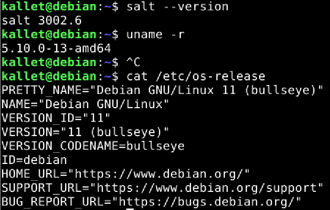

# **h1 Hei maailma & monet tilat**

I started @ 13.40.
  
The source for the excersice [Tero Karvinen](https://terokarvinen.com/2021/configuration-management-systems-2022-spring/#h1-hei-maailma--monet-tilat)
  
**Hardware & Software**  
*Win 11 + VirtualBox 6.0 + Debian 11 Bullseye*  
  
*Hardware:*  
*CPU: AMD Ryzen 9 5900HS*  
*Mem: 16 Gt LPDDR4X*  
*Storage: 512 Gt M.2 2230 NVMe PCIe 3.0 SSD*  
  
##  z) Lue ja tiivistä ##

**[Salt Run Command Locally](https://terokarvinen.com/2021/salt-run-command-locally/)**  
  
Salt can by used locally, as well as to maintain a large number of slave computers. Local use is usefull for trying out things before implementing them to production systems.

The article teaches you how to install and use the most important functionality of Salt locally:
	0. pkg - is for managing that packages are installed 
	1. file - is for managing that a file exists
	2. service - is for managing processes (daemons)
	3. user - is for managing users
	4. cmd - is for executing commands (THIS IS NOT IDEMPOTENT BY DEFAULT!)
  
**[Salt Quickstart – Salt Stack Master and Slave on Ubuntu Linux](https://terokarvinen.com/2018/salt-quickstart-salt-stack-master-and-slave-on-ubuntu-linux/)**  
  
This article is about the building blocks for controlling a vast horde of computers.  
  
The main takeaways are:  
-What to install for a slave (salt-minion)
-What to install for a master  (salt-master)
-What actions are needed for the slave (edit the master's dns/ip in the minion's conf)
-What actions are needed for the master (Accept the key from the slave)
  
**[Vagrant Revisited – Install & Boot New Virtual Machine in 31 seconds](https://terokarvinen.com/2017/04/11/vagrant-revisited-install-boot-new-virtual-machine-in-31-seconds/)**  
  
A quick and painless article about initializing a virtual machine quick - something I just had to try out!  
  
````
E: Package 'virtualbox' has no installation candidate
````  
  
Seems to me, that there wasn't a virtualbox package to be had anymore, so I decided to try it out without it. That wasn't a huge success, since it was obviously missing some key components.  
  
````
kallet@debian:~$ vagrant init bento/ubuntu-16.04
A `Vagrantfile` has been placed in this directory. You are now
ready to `vagrant up` your first virtual environment! Please read
the comments in the Vagrantfile as well as documentation on
`vagrantup.com` for more information on using Vagrant.

kallet@debian:~$ vagrant up
Bringing machine 'default' up with 'libvirt' provider...
Error while connecting to Libvirt: Error making a connection to libvirt URI qemu:///system?no_verify=1&keyfile=/home/kallet/.ssh/id_rsa:
Call to virConnectOpen failed: Failed to connect socket to '/var/run/libvirt/libvirt-sock': No such file or directory
````
  
The error said something about SSD, so I thought it might have been an issue, so I installed SSH:  
  
*sudo apt-get install -y ssh*  
  
That didn't solve my problem, so I was just left with the problem of not having a virtualbox-pkg installed. I followed a [tutorial](https://www.how2shout.com/linux/installing-virtualbox-app-on-debian-11-bullseye/) (parts 1-5) and managed to install virtualbox with that.  
  
I tried to initiate vagrant:  
*vagrant up*  
  
I got rewarded with an error.  
  
````
==> default: Clearing any previously set network interfaces...
==> default: Preparing network interfaces based on configuration...
    default: Adapter 1: nat
==> default: Forwarding ports...
    default: 22 (guest) => 2222 (host) (adapter 1)
==> default: Booting VM...
There was an error while executing `VBoxManage`, a CLI used by Vagrant
for controlling VirtualBox. The command and stderr is shown below.

Command: ["startvm", "ca5dd2df-5ba6-405f-8b82-9fa0c926b91c", "--type", "headless"]

Stderr: VBoxManage: error: AMD-V is not available (VERR_SVM_NO_SVM)
VBoxManage: error: Details: code NS_ERROR_FAILURE (0x80004005), component ConsoleWrap, interface IConsole
````

My guess is that the fact I was running a virtualization of Debian already might be complicating things, and the CPU wasn't available for the second virtulbox in a way that it would have liked to.  
  
**[Two Machine Virtual Network With Debian 11 Bullseye and Vagrant](https://terokarvinen.com/2021/two-machine-virtual-network-with-debian-11-bullseye-and-vagrant/)**  
  
The article explains how to do the installing and running of a virtualbox in vagrant. It starts with installation, continues to configuration and proceed to validation of the installation.  
  
I had to try this out too, since I didn't manage to do it on my own. This time it ended up witrh a different error msg.  
  
````
There was an error while executing `VBoxManage`, a CLI used by Vagrant
for controlling VirtualBox. The command and stderr is shown below.

Command: ["hostonlyif", "ipconfig", "vboxnet0", "--ip", "192.168.88.1", "--netmask", "255.255.255.0"]

Stderr: VBoxManage: error: Code E_ACCESSDENIED (0x80070005) - Access denied (extended info not available)
VBoxManage: error: Context: "EnableStaticIPConfig(Bstr(pszIp).raw(), Bstr(pszNetmask).raw())" at line 242 of file VBoxManageHostonly.cpp
````

So, I deduced that I might have messed up something by providing a new repo address and a new version of VirtualBox.  
  
I removed the source I had added to sources on the previous tutorial:  
*sudo rm /etc/apt/sources.list.d/virtualbox.list*  
  
I wasn't able to find a pkg to install from the Debian default repos:
*sudo apt search virtualbox*  
  
So the article needs updating, as it's not possible to install and use vargant + virtualbox with the instructions it provides. 
  
**[Command Line Basics Revisited](https://terokarvinen.com/2020/command-line-basics-revisited/)**
  
The article goes throught the basic Linux commands. Changing directories, manipulating files, ssh-connections, manual pages, using tab to minimize typing, the locations very everything important is located and installing software.

I took a break @ 14.51.  
  
Started again @ 15.42.  
  
##a) Mikä meininki? Selvitä, mikä käyttöjärjestelmä (Linuxin versio) sinulla on käytössä, ja mikä Saltin versio.  
  
So, this is how I figured out my Linux version and my salt version:  
	
	salt --version  
	cat /etc/os-release  
  

  
*I had version 3002.6 of Salt and Debian 11*  
  


