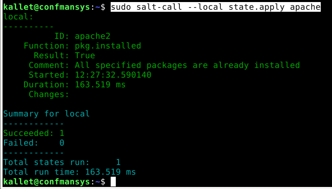
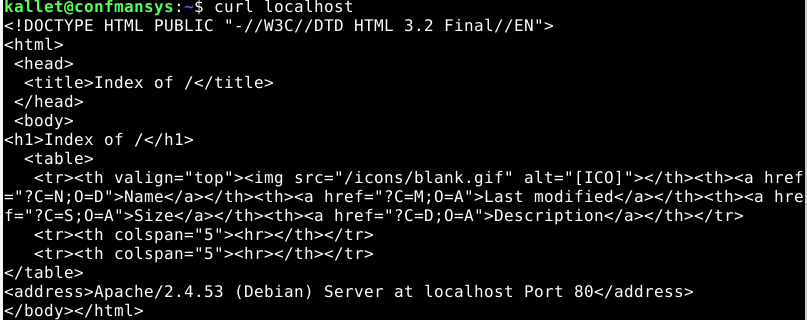
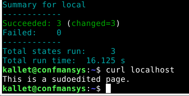
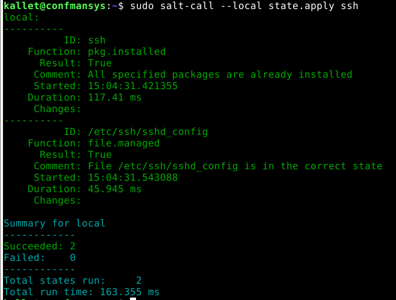

# **h2 package-file-service**

I started @ 14.05.
  
The source for the exercise [h2](https://terokarvinen.com/2021/configuration-management-systems-2022-spring/#h2-package-file-service)
  
**Hardware & Software**  
*Win 11 + VirtualBox 6.0 + Debian 11 Bullseye*  
  
*Hardware:*  
*CPU: AMD Ryzen 9 5900HS*  
*Mem: 16 Gt LPDDR4X*  
*Storage: 512 Gt M.2 2230 NVMe PCIe 3.0 SSD*  
  
##  z) Lue ja tiivistä / Reading exercise  

**[SaltStack Configuration Management: Get Started Tutorial - Introduction](https://docs.saltproject.io/en/getstarted/config/index.html)**  
  
This was just a bullet point list of things you'll be using:  
-Salt state function calls  
-includes  
-requisites  
-Jinja  

It also explains that Salt let's you define a desired state (idempotency) regarding applications, files and settings, ie. everything.  
  
**[SaltStack Configuration Management: Get Started Tutorial - Functions](https://docs.saltproject.io/en/getstarted/config/functions.html)**  
  
-Functions are the secret sauce that makes Salt do it's magic  
-They can be used to:  
*"install and configure applications, create users, distribute files, and about anything else you might need to do when setting up your systems."*  
-Salt states are written in [YAML](https://yaml.org/) (YAML Ain't Markeup Language)  
-The basic idea is that it's like JSON, but without so many special characters (those are replaced with spaces)  
  
  
*Screencap from the source, YAML syntax example*  
  
-Program blocks are marked with 2 spaces  
-After the hyphen, there is also 1 space  
  
Karvinen also stated in our previous session that the ID will be used as a name, if no name is given in the function. As an example, an ID of apache, would be named apache, if no other name is given. The article gives contrary advise and urges you to name your functions with a descriptive name.  
  
  
*Screencap from an example function from the source*  
  
The example picture is of a function that first makes sure a package is installed and then checks that the installed service is running.  
  
-You should note that Salt execution functions (unlike state-functions) don't check if the service is already running before doing their job. For example **service.running** is a state function and it checks before issuing a restart and **service.restart** is an execution function and just restarts the service.  
   
You can do a dry run in production systems with a test-parameter. Just by adding "test=True" to the end of your command.  
  
state.apply looks for a init.sls-file that contains your functions to apply in the directory that you specify.  
	
	sudo salt '*' state.apply apache test=True
	#this command would look for /srv/salt/apache/init.sls and do it's bidding to all minions in a test mode.  
  
**[SaltStack Configuration Management: Get Started Tutorial - Files](https://docs.saltproject.io/en/getstarted/config/files.html)**  
  
-Salt has a built-in server for files  
-files places in /srv/salt are available for salt minions (the path is salt://(path in /srv/salt/)  
You could, for example, manage Apache conf-files as such (direct quote):  
  
````
deploy the http.conf file:
  file.managed:
    - name: /etc/http/conf/http.conf
    - source: salt://apache/http.conf
````
  
The absolute path in Salt master would be: /srv/salt/apache/http.conf  
  
Managing conf-files in this manner has a great advantage:  
**Every minion that this is applied to, will have the same settings**
  
I quit for the day @ 17.32 after about 1 hours worth of active learning.  
  
Started work @ 9.53.  
  
**[Install Apache Web Server on Ubuntu](https://terokarvinen.com/2008/05/02/install-apache-web-server-on-ubuntu-4/)**  
  
-Simple instructions on how to install and test an apache installation.  
-Also provides instructions on how to enable user homepages

The key takeaway is in my opinion that you should always test the things that you build.  
  
**[Apache User Homepages Automatically – Salt Package-File-Service Example](https://terokarvinen.com//2018/apache-user-homepages-automatically-salt-package-file-service-example/)**  
  
This article expands on the previous one. It gives instructions on how to enable user homepages with a salt function.  
  
The main point is in the second paragraph: you should, and can,  only automate things you are able to do manually. So test out the function of your function first and THEN automate it.  
  
The article also had a nice command for figuring out the time when a file was edited:  
	
	find -printf "%T+ %p\n"|sort 
	
This command will print out the date when a file was edited + the file name in a given directory.  
  
In salt there are a different ways of getting to the same end goal - you can use CLI-command or native functions. With CLI-commands you have to be mindfull of making the command idempotent yourself.  
  
**[Pkg-File-Service – Control Daemons with Salt – Change SSH Server Port](https://terokarvinen.com//2018/pkg-file-service-control-daemons-with-salt-change-ssh-server-port/)**  
  
The article tells you how to:    
-Create a salt SSH-state  
-Create a ssh-config-file in your salt-directory  
-Apply changes to your minions  
  
This is config management: first, install a package -> replace a configuration and then start the daemon.  
  
**[Salt system architecture](https://docs.saltproject.io/en/latest/topics/salt_system_architecture.html)**  
  
-Salt is made with Python  
-It's for managing and automating systems remotely  
-Salt doesn't care about the minion's operating system, it works on Win & Linux both  
  
Salt uses a master-minion model. This means that a master has salt-master installed and minions have salt-minion - the minion knows the master's address and the master has accepted the minion's key(s). Master tells the minions what to do and the minions fullfill their master's commands.  
  
You can target 1 minion, group(s) of minions or all of your minions.  
  
-Salt is faster than higher level com protocols like http  
-You can use salt to run cli commands or use it as a configuration management system with yaml-files  
  
A top file gives instructions to salt on what functions to apply to which minions.  
  
-Salt pillars are used for transfering secure data, like credentials of configuration details.  
  
Beacons provide information to master and reactors can do automatic responses, should the need arise. An example of an automated response would be an automatic rollback to a previous software version.  
  
Salt runners are like salt execution modules. They execute on the master instead of the minion.  
  
I took a break @ 10.40.  
  
Started work again @ 11.59.  
  
## a) Oletussivu. Vaihda Apachen oletussivu päällekirjoittamalla /var/ww/html/index.html . Voit käyttää pohjana tunnilla tekemääsi Apache-asennusta. / Change the default page for apache  
  
So, the package-file-service workflow for this installation should be:  
1. Check that apache is installed, install if not -> test
2. Write a new homepage for apache's default config -> test
3. Restart/start apache  
4. Verify the results  
  
Atleast, that was my assumption. My gameplan was to first do these steps manually and then automate them.  
  
First, I installed apache, started the service and checked that it was running:  
	
	sudo apt-get update  
	sudo apt-get install -y apache2  
	sudo systemctl restart apache2.service  
	curl localhost -S |grep title  
	
````
kallet@confmansys:~$ curl localhost -s |grep title
    <title>Apache2 Debian Default Page: It works</title>
````
	
Then it was time to change the apache homepage:  
	
	sudo echo "This is a new page" |tee /var/www/html/index.html
	
That didn't work out the way I wanted it to:  
````
kallet@confmansys:~$ sudo echo "This is a new page" |tee /var/www/html/index.html
tee: /var/www/html/index.html: Permission denied
This is a new page
````
  
Next I edited the file with micro and restarted the daemon and did a test:  
	
	sudoedit /var/www/html/index.html
	sudo systemctl restart apache2.service  
	curl localhost

````
kallet@confmansys:~$ curl localhost
This is a sudoedited page.
````
  
So, that was the manual process of doing this and now it was time to automate it!  
  
First I removed the state that we made in class:  
	
	sudo rm -r /srv/salt/apache/

Then I made a directory for apache and an init.sls file in it:  
	
	sudo mkdir /srv/salt/apache  
	sudoedit /srv/salt/apache/init.sls  
	
To make things as easy as possible I started with a pkg-function and tested it with salt.  
  
````
apache2:
  pkg.installed #this will install apache2 if not yet installed. No need for a name, since it will use the function's name if no name parameter is given.
````
  
My test was done with:  
	
	sudo salt-call --local state.apply apache  
	
  
*Local test*  
  
Next I made the index.html-file available for salt by adding a few lines to my init.sls:  
	
	sudoedit /srv/salt/apache/init.sls  
	
````
apache2:
  pkg.installed
  
  /var/www/html/index.html:
   file.managed:
     - source: salt://index.html
````
	
Then I copied my index.html to the correct directory:  
	
	sudo cp /var/www/html/index.html /srv/salt/apache/
	
After that I made a test run to see if this would work:  
	
	sudo salt-call --local state.apply apache

````
[CRITICAL] Rendering SLS 'base:apache' failed: mapping values are not allowed in this context
local:
    Data failed to compile:
----------
    Rendering SLS 'base:apache' failed: mapping values are not allowed in this context

````
  
As per usual, nothing works the first time around. Next I went to a [source](https://docs.saltproject.io/en/getstarted/config/files.html) to figure out why my file wasn't applied.  
  
My first thought was that I had the wrong path, so I changed that:  
````
apache2:
  pkg.installed
  
  /var/www/html/index.html:
   file.managed:
     - source: salt://apache/index.html
````  
  
Still the same error persisted, so no progress. The next edit was:  
````
apache2:
  pkg.installed
  
file.managed:
  - name: /var/www/html/index.html
  - source: salt://apache/index.html
````
  
Now I had a different error, so I had made some progress (or not):  
````
local:
    Data failed to compile:
----------
    ID file.managed in SLS apache is not a dictionary
````
  
Next I checked a page in the earlier part of [this exercise](https://terokarvinen.com//2018/apache-user-homepages-automatically-salt-package-file-service-example/) and made changes accordingly:  
````
apache2:
  pkg.installed
  
/var/www/html/index.html:
     file.managed:
       - source: salt://apache/index.html
````
  
  
*This time everything worked like a charm on my local test*  
  
Then I just had the restarting of the daemon left to automate, so I added a few lines again to init.sls:  
````
apache2:
  pkg.installed #Makes sure apache2 is installed, will install if not installed
  
/var/www/html/index.html:
     file.managed:
       - source: salt://apache/index.html #Makes sure that file is the same as in source, will overwrite if not the same

apache2service:
 service.running:
   - name: apache2
   - watch:
     - file: /var/www/html/index.html #restarts the service if file @ source location is changed

````
  
The source for this code was the same as in above.  
````
kallet@confmansys:~$ sudo salt-call --local state.apply apache
local:
----------
          ID: apache2
    Function: pkg.installed
      Result: True
     Comment: All specified packages are already installed
     Started: 12:59:22.546600
    Duration: 116.306 ms
     Changes:   
----------
          ID: /var/www/html/index.html
    Function: file.managed
      Result: True
     Comment: File /var/www/html/index.html is in the correct state
     Started: 12:59:22.667714
    Duration: 47.053 ms
     Changes:   
----------
          ID: apache2service
    Function: service.running
        Name: apache2
      Result: True
     Comment: The service apache2 is already running
     Started: 12:59:22.716329
    Duration: 89.556 ms
     Changes:   

Summary for local
------------
Succeeded: 3
Failed:    0
------------
````
  
The salt print verified that everything was as it was supposed to be.  
  
## b) Tri Kaaaos. Aiheuta erilaisia vikatilanteita ja osoita, kuinka Apache-tilasi korjaa ne. Voit esimerksi sulkea demonin (sudo systemctl stop foobar), poistaa asetukset tai poistaa apachen paketit. Osoita yksinkertaisin testein, saat palvelun toimimattomaksi, ja salt-tilasi saa sen jälleen toimimaan. / Cause some errors and show how your apache-state fixes those  
  
Now I had to test my states. I did that in reverse order,  so first I stopped the service and checked if my state would start it again:  
	
	sudo systemctl stop apache2.service
	sudo systemctl status apache2.service
	curl localhost
	
	
	curl: (7) Failed to connect to localhost port 80: Connection refused
	
I had stopped the service and next I tried to start it with my state:  
	
	sudo salt-call --local state.apply apache
	
````
----------
          ID: apache2service
    Function: service.running
        Name: apache2
      Result: True
     Comment: Started Service apache2
     Started: 13:06:07.514940
    Duration: 192.73 ms
     Changes:   
              ----------
              apache2:
                  True

Summary for local
------------
Succeeded: 3 (changed=1)
Failed:    0
------------
````
  
  
*Changes were made, and I checked localhost manually just to be sure.*  
  
The state worked as it should have, so next I removed my default html-file:  
	
	sudo rm /var/www/html/index.html
	sudo systemctl restart apache2.service
	curl localhost
	
  
*There was nothing to see*  
  
Next I applied my state and it made 2 changes (it copied the index.html and then restarted the service):  
````
local:
----------
          ID: apache2
    Function: pkg.installed
      Result: True
     Comment: All specified packages are already installed
     Started: 14:06:54.960357
    Duration: 125.121 ms
     Changes:   
----------
          ID: /var/www/html/index.html
    Function: file.managed
      Result: True
     Comment: File /var/www/html/index.html updated
     Started: 14:06:55.090260
    Duration: 50.522 ms
     Changes:   
              ----------
              diff:
                  New file
              mode:
                  0644
----------
          ID: apache2service
    Function: service.running
        Name: apache2
      Result: True
     Comment: Service restarted
     Started: 14:06:55.193300
    Duration: 153.637 ms
     Changes:   
              ----------
              apache2:
                  True

Summary for local
------------
Succeeded: 3 (changed=2)
Failed:    0
------------
Total states run:     3
Total run time: 329.280 ms
````
  
  
*I made sure by curling localhost*  
  
The last test was removing apache and the default site:  
	
	sudo rm /var/www/html/index.html
	sudo apt-get purge apache2*
	sudo systemctl stop apache2.service
	
  
*Back to square one*  
  
I executed my state again and checked for results:  
	
	sudo salt-call --local state.apply apache
	
````
Summary for local
------------
Succeeded: 3 (changed=3)
Failed:    0
````
  
Salt made 3 changes, just as it should've. I checked the result with curl and Firefox.  
  
  
*Curl returned the expected outcome*  
  
  
*Firefox rendered the page I wanted*  
  
## c) Shh! Asenna ja konfiguroi SSH-demoni. Laita se porttiin 7373. / Install SSH to port 7373  
  
The sources used: [https://terokarvinen.com//2018/pkg-file-service-control-daemons-with-salt-change-ssh-server-port/](https://terokarvinen.com//2018/pkg-file-service-control-daemons-with-salt-change-ssh-server-port/)  
[https://terokarvinen.com/2021/configuration-management-systems-2022-spring/#h2-package-file-service](https://terokarvinen.com/2021/configuration-management-systems-2022-spring/#h2-package-file-service)  
[https://linuxhint.com/enable-ssh-server-debian/](https://linuxhint.com/enable-ssh-server-debian/)  
[https://www.ionos.com/help/server-cloud-infrastructure/getting-started/important-security-information-for-your-server/changing-the-default-ssh-port/](https://www.ionos.com/help/server-cloud-infrastructure/getting-started/important-security-information-for-your-server/changing-the-default-ssh-port/)  

  
First it was time to do a manual install on the ssh-metapackage:  
	
	sudo apt-get install -y ssh

Next I checked the service status:  
	
	sudo systemctl status ssh
	
````
kallet@confmansys:~$ sudo systemctl status ssh
● ssh.service - OpenBSD Secure Shell server
     Loaded: loaded (/lib/systemd/system/ssh.service; enabled; vendor preset: e>
     Active: inactive (dead)
       Docs: man:sshd(8)
             man:sshd_config(5)
````

The service was not active, so I started it:  
	
	sudo systemctl start ssh
	
  
*SSH was running @ port 22*  
  
Next I did [some searching](https://www.ionos.com/help/server-cloud-infrastructure/getting-started/important-security-information-for-your-server/changing-the-default-ssh-port/) on how to change the default port configuration:   
	
	sudoedit /etc/ssh/sshd_config

  
*I edited 1 line with the port 7373*  
  
Next I restarted the daemon and checked it's status:  
	
	sudo systemctl restart ssh
	sudo systemctl status ssh
	
````
kallet@confmansys:~$ sudo systemctl status ssh
● ssh.service - OpenBSD Secure Shell server
     Loaded: loaded (/lib/systemd/system/ssh.service; enabled; vendor preset: e>
     Active: active (running) since Mon 2022-04-11 14:51:31 EEST; 4s ago
       Docs: man:sshd(8)
             man:sshd_config(5)
    Process: 12945 ExecStartPre=/usr/sbin/sshd -t (code=exited, status=0/SUCCES>
   Main PID: 12946 (sshd)
      Tasks: 1 (limit: 9448)
     Memory: 1.1M
        CPU: 28ms
     CGroup: /system.slice/ssh.service
             └─12946 sshd: /usr/sbin/sshd -D [listener] 0 of 10-100 startups

huhti 11 14:51:31 confmansys systemd[1]: Starting OpenBSD Secure Shell server...
huhti 11 14:51:31 confmansys sshd[12946]: Server listening on 0.0.0.0 port 7373.
huhti 11 14:51:31 confmansys sshd[12946]: Server listening on :: port 7373.
huhti 11 14:51:31 confmansys systemd[1]: Started OpenBSD Secure Shell server.
lines 1-17/17 (END)
````
  
Manual version of my future state-function worked and SSH was running @ port 7373.  
  
**Time to automate**  
  
First, I made a directory for my state and a state for installing ssh:  
	
	sudo mkdir /srv/salt/ssh  
	sudoedit /srv/salt/ssh/init.sls  
	
````
#init.sls
ssh:
  pkg.installed
````  
  
Then I checked if I had done this first step correctly with:  
	
	sudo salt-call --local state.apply ssh
	
````
local:
----------
          ID: ssh
    Function: pkg.installed
      Result: True
     Comment: All specified packages are already installed
     Started: 14:56:59.891480
    Duration: 118.633 ms
     Changes:   

Summary for local
------------
Succeeded: 1
Failed:    0
------------
Total states run:     1
Total run time: 118.633 ms
````
  
Pkg was installed, so next I needed to copy the config-file to the correct location for Salt's file server:  
	
	sudo cp /etc/ssh/sshd_config /srv/salt/ssh/
	
After this I had the config file ready and just needed to make changes for copying it in my Salt state:  
	
	sudoedit /srv/salt/ssh/init.sls
	
````
#init.sls
ssh:
  pkg.installed

/etc/ssh/sshd_config:
  file.managed:
    - source: salt://ssh/sshd_config
````
  
  
*the state worked as it should have*  
  
Finally it was time to restart the service, if the config-file changed, so I made some more changes to init.sls:  
  
````
#init.sls
ssh:
  pkg.installed

/etc/ssh/sshd_config:
  file.managed:
    - source: salt://ssh/sshd_config

ssh.service:
 service.running:
   - name: ssh
   - watch:
     - file: /etc/ssh/sshd_config
````  
  
I got the service's name from "systemctl status ssh".  
  
````
kallet@confmansys:~$ sudo salt-call --local state.apply ssh
local:
----------
          ID: ssh
    Function: pkg.installed
      Result: True
     Comment: All specified packages are already installed
     Started: 15:09:55.321897
    Duration: 115.463 ms
     Changes:   
----------
          ID: /etc/ssh/sshd_config
    Function: file.managed
      Result: True
     Comment: File /etc/ssh/sshd_config is in the correct state
     Started: 15:09:55.441793
    Duration: 48.883 ms
     Changes:   
----------
          ID: ssh.service
    Function: service.running
        Name: ssh
      Result: True
     Comment: The service ssh is already running
     Started: 15:09:55.492440
    Duration: 47.964 ms
     Changes:   

Summary for local
------------
Succeeded: 3
Failed:    0
------------
Total states run:     3
Total run time: 212.310 ms
````
  
**Testing**  
  
The test was done in 4 steps:    
1. The config file was deleted  
2. SSH was purged  
3. Service was stopped  
4. The state was applied  
	
	sudo rm /etc/ssh/sshd_config  
	sudo apt-get purge -y ssh  
	sudo systemctl stop ssh  
	sudo systemctl status ssh  
	
  
````
kallet@confmansys:~$ sudo systemctl status ssh
● ssh.service - OpenBSD Secure Shell server
     Loaded: loaded (/lib/systemd/system/ssh.service; enabled; vendor preset: e>
     Active: inactive (dead) since Mon 2022-04-11 15:14:22 EEST; 28s ago
       Docs: man:sshd(8)
             man:sshd_config(5)
    Process: 12945 ExecStartPre=/usr/sbin/sshd -t (code=exited, status=0/SUCCES>
    Process: 12946 ExecStart=/usr/sbin/sshd -D $SSHD_OPTS (code=exited, status=>
   Main PID: 12946 (code=exited, status=0/SUCCESS)
        CPU: 29ms

huhti 11 14:51:31 confmansys systemd[1]: Starting OpenBSD Secure Shell server...
huhti 11 14:51:31 confmansys sshd[12946]: Server listening on 0.0.0.0 port 7373.
huhti 11 14:51:31 confmansys sshd[12946]: Server listening on :: port 7373.
huhti 11 14:51:31 confmansys systemd[1]: Started OpenBSD Secure Shell server.
huhti 11 15:14:22 confmansys sshd[12946]: Received signal 15; terminating.
huhti 11 15:14:22 confmansys systemd[1]: Stopping OpenBSD Secure Shell server...
huhti 11 15:14:22 confmansys systemd[1]: ssh.service: Succeeded.
huhti 11 15:14:22 confmansys systemd[1]: Stopped OpenBSD Secure Shell server.
````
  
Then I just executed my SSH-state and it printed out a promising report:  
	
	sudo salt-call --local state.apply ssh
	
  
  
*SSH made a comeback*  
  
Just to be sure, I checked the service's status:  
	
	sudo systemctl status ssh
	
````
kallet@confmansys:~$ sudo systemctl status ssh
● ssh.service - OpenBSD Secure Shell server
     Loaded: loaded (/lib/systemd/system/ssh.service; enabled; vendor preset: e>
     Active: active (running) since Mon 2022-04-11 15:16:00 EEST; 2min 51s ago
       Docs: man:sshd(8)
             man:sshd_config(5)
    Process: 14741 ExecStartPre=/usr/sbin/sshd -t (code=exited, status=0/SUCCES>
   Main PID: 14742 (sshd)
      Tasks: 1 (limit: 9448)
     Memory: 1.1M
        CPU: 29ms
     CGroup: /system.slice/ssh.service
             └─14742 sshd: /usr/sbin/sshd -D [listener] 0 of 10-100 startups

huhti 11 15:16:00 confmansys systemd[1]: Starting OpenBSD Secure Shell server...
huhti 11 15:16:00 confmansys sshd[14742]: Server listening on 0.0.0.0 port 7373.
huhti 11 15:16:00 confmansys sshd[14742]: Server listening on :: port 7373.
huhti 11 15:16:00 confmansys systemd[1]: Started OpenBSD Secure Shell server.
````
  
The daemon was running @ port 7373.  
  
I completed my work after a quick recap @ 15.47 and did a Git commit.  