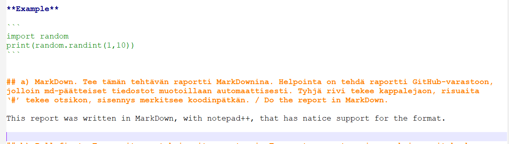

# **h3 Versionhallinta / Managing versions**

I started @ 12.02.
  
The source for the exercise [h3](https://terokarvinen.com/2021/configuration-management-systems-2022-spring/#h3-versionhallinta)
  
**Hardware & Software**  
*Win 11 + VirtualBox 6.0 + Debian 11 Bullseye*  
  
*Hardware:*  
*CPU: AMD Ryzen 9 5900HS*  
*Mem: 16 Gt LPDDR4X*  
*Storage: 512 Gt M.2 2230 NVMe PCIe 3.0 SSD*  
  
##  z) Lue ja tiivistä / Reading exercise  
  
** https://commonmark.org/help/ **  
  
The article tell the gospel of .md. It's a really simple way of doing word processing. It does only some basic stuff, but the key function of text isn't to look extra fance - it's to convey information. In that regard, MarkDown is the alpha of alpha's on the field. You can create links, headings, show images, quote code **with intendations intact** and get stuff done extremely quickly.  
  
Key takeaway for me:  
-You can highlight code by putting it between backticks: \```  code goes here \```  
  
**Example**  
  
```
import random
print(random.randint(1,10))
```
  

## a) MarkDown. Tee tämän tehtävän raportti MarkDownina. Helpointa on tehdä raportti GitHub-varastoon, jolloin md-päätteiset tiedostot muotoillaan automaattisesti. Tyhjä rivi tekee kappalejaon, risuaita ‘#’ tekee otsikon, sisennys merkitsee koodinpätkän. / Do the report in MarkDown.

This report was written in MarkDown, with notepad++, that has natice support for the format. Notepad++ makes the formatting obvious even when you're writing your text - you can easily notice when you do a typo from the UI.  
  
  
*Native support for the md-syntax*  
  
## b) Pull first. Tee useita muutoksia git-varastoosi. Tee muutama muutos, jossa yksi commit koskee useampaa tiedostoa. Anna hyvä kuvaukset (commit message), yksi englanninkielinen lause imperatiivissa (määräysmuodossa) "Add top level menu to Foobar synchronizer" / Use Git properly
  
First I added this article to my course repository. My repository already existed, so I didn't have to initiate it. These commands were given in the directory that this article was in.   
	
	git pull
	git push
	git add .
	git commit -m "Made initial commit for article"
	git pull
	git push
	

## c) Kaikki kirjataan. Näytä omalla git-varastollasi esimerkit komennoista ‘git log’, ‘git diff’ ja ‘git blame’. Selitä tulokset. / Explain the output from Git-commands

## c) Huppis! Tee tyhmä muutos gittiin, älä tee commit:tia. Tuhoa huonot muutokset ‘git reset --hard’. Huomaa, että tässä toiminnossa ei ole peruutusnappia.

## d) Formula. Tee uusi salt-tila (formula, moduli, infraa koodina). (Eli uusi tiedosto esim. /srv/salt/terontila/init.sls). Voit tehdä ihan yksinkertaisen parin funktion (pkg, file...) tilan, tai edistyneemmin asentaa ja konfiguroida minkä vain uuden ohjelman: demonin, työpöytäohjelman tai komentokehotteesta toimivan ohjelman. Käytä tarvittaessa ‘find -printf “%T+ %p\n”|sort’ löytääksesi uudet asetustiedostot. / Make a new state with Salt

## f) Vapaaehtoinen: Laita srv/salt/ gittiin. Tee uusi moduli. Kloonaa varastosi toiselle koneelle (tai poista srv/salt ja palauta se kloonaamalla) ja jatka sillä. / add a Salt state to Git

  