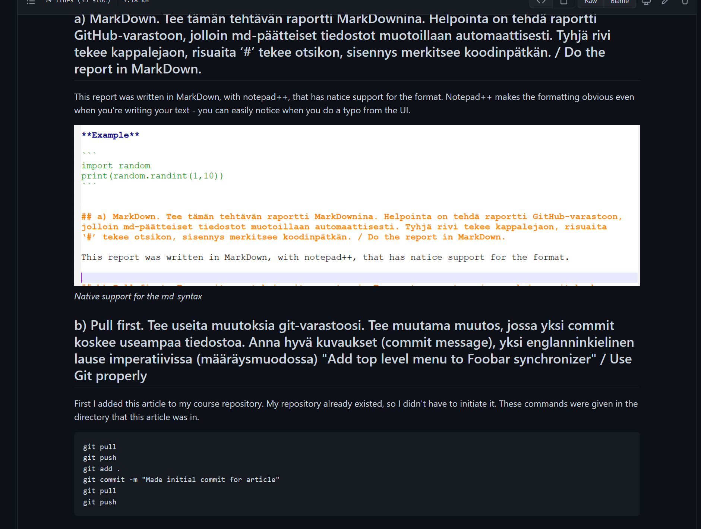

# **h3 Versionhallinta / Managing versions**

I started @ 12.02.
  
The source for the exercise [h3](https://terokarvinen.com/2021/configuration-management-systems-2022-spring/#h3-versionhallinta)
  
**Hardware & Software**  
*Win 11 + VirtualBox 6.0 + Debian 11 Bullseye*  
  
*Hardware:*  
*CPU: AMD Ryzen 9 5900HS*  
*Mem: 16 Gt LPDDR4X*  
*Storage: 512 Gt M.2 2230 NVMe PCIe 3.0 SSD*  
  
##  z) Lue ja tiivistä / Reading exercise  
  
** https://commonmark.org/help/ **  
  
The article tell the gospel of .md. It's a really simple way of doing word processing. It does only some basic stuff, but the key function of text isn't to look extra fance - it's to convey information. In that regard, MarkDown is the alpha of alpha's on the field. You can create links, headings, show images, quote code **with intendations intact** and get stuff done extremely quickly.  
  
Key takeaway for me:  
-You can highlight code by putting it between backticks: \```  code goes here \```  
  
**Example**  
  
```
import random
print(random.randint(1,10))
```
  

## a) MarkDown. Tee tämän tehtävän raportti MarkDownina. Helpointa on tehdä raportti GitHub-varastoon, jolloin md-päätteiset tiedostot muotoillaan automaattisesti. Tyhjä rivi tekee kappalejaon, risuaita ‘#’ tekee otsikon, sisennys merkitsee koodinpätkän. / Do the report in MarkDown.

This report was written in MarkDown, with notepad++, that has natice support for the format. Notepad++ makes the formatting obvious even when you're writing your text - you can easily notice when you do a typo from the UI.  
  
  
*Native support for the md-syntax*  
  
## b) Pull first. Tee useita muutoksia git-varastoosi. Tee muutama muutos, jossa yksi commit koskee useampaa tiedostoa. Anna hyvä kuvaukset (commit message), yksi englanninkielinen lause imperatiivissa (määräysmuodossa) "Add top level menu to Foobar synchronizer" / Use Git properly
  
First I added this article to my course repository. My repository already existed, so I didn't have to initiate it. These commands were given in the directory that this article was in.   
	
	git pull
	git push
	git add .
	git commit -m "Made initial commit for article"
	git pull
	git push
	
````  
C:\Confmansys>git commit -m "Made initial commit for article"
[main 663f965] Made initial commit for article
 4 files changed, 121 insertions(+), 1 deletion(-)
 create mode 100644 h3.md
 create mode 100644 h3.md.bak
 create mode 100644 pics/h3/1.png
````
  
As it is obvious from the CLI, Git works with Windows too.  
  
  
*Going meta - rendered MarkDown in Github*  

## c) Kaikki kirjataan. Näytä omalla git-varastollasi esimerkit komennoista ‘git log’, ‘git diff’ ja ‘git blame’. Selitä tulokset. / Explain the output from Git-commands

I continued this article in my Virtualbox-Linux and Micro. Here's a tip to make MarkDown readable in Micro:  

	Push ctrl + e #for Micro settings
	set softwrap true

This is a handy way to make text wrap so that it fits smaller screen sizes.  

Source: https://terokarvinen.com/2022/micro-editor-lsp-support-python-and-go-jump-to-definition-show-function-signature/  

Next, I made a pull and a push.

	git pull
	git push

Then I executed the log-command.

	git log

````
commit 71a6d27a0076c7124b55525c89cbf13b34e3d0ee (HEAD -> main, origin/main, origin/HEAD)
Author: Kalle Tolonen <kalle.tolonen@gmail.com>
Date:   Sat Apr 16 12:50:40 2022 +0300

    Added a picture

commit 663f965efa48445061f4b7c324834ea2fee14b9c #The commit hash, it's unique
Author: Kalle Tolonen <kalle.tolonen@gmail.com> #commit author
Date:   Sat Apr 16 12:46:50 2022 +0300			#commit time and date

    Made initial commit for article				#commit message

commit f91d7a9c7e949d057f3a2c328cc914edc4a2bf52
Author: Kalle Tolonen <kalle.tolonen@gmail.com>
Date:   Thu Apr 14 13:28:29 2022 +0300

    Add notes

commit 301f721e52c2941cbadf5a9fcf8c1e3880695903	#Earlier commit to the same repository
Author: Kalle Tolonen <kalle.tolonen@gmail.com>
Date:   Mon Apr 11 15:48:38 2022 +0300

    h2, before finishing touches

commit 42c3bcaf6d10d90ea25f5c0ed3a88a43a9bf6e04
Author: Kalle Tolonen <kalle.tolonen@gmail.com>
Date:   Mon Apr 11 15:47:51 2022 +0300

    h2, corrections

````
  
After that I studied the differences:  

	git diff


````
diff --git a/h3.md b/h3.md #File in question
index 7c48f31..346ea3d 100644 #hash (commit) in question
--- a/h3.md
+++ b/h3.md
@@ -47,7 +47,7 @@ First I added this article to my course repository. My repository already existe
        git pull
        git push
        
-```` #Stuff that was removed
+```` #Stuff that was added (compered to the previous version)

 C:\Confmansys>git commit -m "Made initial commit for article"
 [main 663f965] Made initial commit for article
  4 files changed, 121 insertions(+), 1 deletion(-)
@@ -55,19 +55,71 @@ C:\Confmansys>git commit -m "Made initial commit for article"
  create mode 100644 h3.md.bak
  create mode 100644 pics/h3/1.png
 
-
+  
```` 

Finally, it was time to find the blame.  

	git blame

Git blame will show you who did what:  
````
kallet@confmansys:~/ConfManSystems$ git blame h1.md
af3c3e48 (Kalle Tolonen 2022-04-02 09:27:42 +0300   1) # **h1 Hei maailma & monet tilat  / Hello World and states**
e66fc9b2 (Kalle Tolonen 2022-04-01 15:49:24 +0300   2) 
e66fc9b2 (Kalle Tolonen 2022-04-01 15:49:24 +0300   3) I started @ 13.40.
e66fc9b2 (Kalle Tolonen 2022-04-01 15:49:24 +0300   4)   
af3c3e48 (Kalle Tolonen 2022-04-02 09:27:42 +0300   5) The source for the exercise  [Tero Karvinen](https://terokarvinen.com/2021/configuration-management-systems-2022-spring/#h1-hei-maailma--monet-tilat)
````
The first element is the commit hash, then it tells you who did it and when. After that there's a line number and the content.  
  
## c) Huppis! Tee tyhmä muutos gittiin, älä tee commit:tia. Tuhoa huonot muutokset ‘git reset --hard’. Huomaa, että tässä toiminnossa ei ole peruutusnappia.  / Make a mistake and cancel it

A made a change in my previous assignment.

	micro h2.md
	#removed the heading
	git diff

````
diff --git a/h2.md b/h2.md
index 1eb8201..7a06396 100644
--- a/h2.md
+++ b/h2.md
@@ -1,4 +1,4 @@
-# **h2 package-file-service**
+

````

After that I gave the command to reset.

	git reset --hard

````
HEAD is now at 29af8ee Write more content for article. #This told me that the file was returned to a previous state
````

Just to be sure, I ran diff again.

	git diff

No print for the command, so no diffence.  

## d) Formula. Tee uusi salt-tila (formula, moduli, infraa koodina). (Eli uusi tiedosto esim. /srv/salt/terontila/init.sls). Voit tehdä ihan yksinkertaisen parin funktion (pkg, file...) tilan, tai edistyneemmin asentaa ja konfiguroida minkä vain uuden ohjelman: demonin, työpöytäohjelman tai komentokehotteesta toimivan ohjelman. Käytä tarvittaessa ‘find -printf “%T+ %p\n”|sort’ löytääksesi uudet asetustiedostot. / Make a new state with Salt

I started by making a list of software and settings I would like to have for studying and work:  
	Micro
	bash-completion
	Git
	Gimp
	Blender
	Python3
	Ufw
	Apache2
	Ssh
	Pwgen

My preferred settings:

	Micro - softwrap = True, tabstospaces = False
	Sudoedit = Micro
	
### Micro

It seems to me that Micro only saves values for settings that are true, ie. it propably presumes that everything else is false. The settings are stored in:

	/home/user/.config/micro/settings.json

So, my first state was going to be installing Micro and making the settings I liked best. I used my previous article as [a source](https://github.com/kalletolonen/ConfManSystems/blob/main/h2.md).  

	sudo mkdir /srv/salt/desktop
	sudoedit /srv/salt/desktop/init.sls

````
micro:
	pkg.installed
````
	
	sudo salt-call --local state.apply desktop

````
[CRITICAL] Rendering SLS 'base:desktop' failed: found character that cannot start any token
local:
    Data failed to compile:
----------
    Rendering SLS 'base:desktop' failed: found character that cannot start any token
````

As a result I had a bizarre error message. Just putting the error message to Google told me that YAML was to blame and I realized that I might have just used a tab instead of spaces when writing the state. I fixed my state to have only spaces as intendations.

	sudoedit /srv/salt/desktop/init.sls
	sudo salt-call --local state.apply desktop

````
micro:
  pkg.installed
````

````
kallet@confmansys:~$ sudo salt-call --local state.apply desktop
local:
----------
          ID: micro
    Function: pkg.installed
      Result: True
     Comment: All specified packages are already installed
     Started: 15:03:45.039126
    Duration: 50.092 ms
     Changes:   

Summary for local
------------
Succeeded: 1
Failed:    0
------------
Total states run:     1
Total run time:  50.092 ms
````

That was more like it. Next it was time to add the settings I wanted in Micro.  

	sudo cp .config/micro/settings.json /srv/salt/desktop/
	#I was in my home directory for this, thus no absolute path
	sudoedit /srv/salt/desktop/init.sls

````
micro:
  pkg.installed

/home/kallet/.config/micro/settings.json:
  file.managed:
    - source: salt://apache/settings.json
````
	
	sudo salt-call --local state.apply desktop
	
````
[ERROR   ] Source file salt://apache/settings.json not found in saltenv 'base'
local:
----------
          ID: micro
    Function: pkg.installed
      Result: True
     Comment: All specified packages are already installed
     Started: 15:13:16.093812
    Duration: 50.837 ms
     Changes:   
----------
          ID: /home/kallet/.config/micro/settings.json
    Function: file.managed
      Result: False
     Comment: Source file salt://apache/settings.json not found in saltenv 'base'
     Started: 15:13:16.158954
    Duration: 18.406 ms
     Changes:   

Summary for local
------------
Succeeded: 1
Failed:    1
------------
Total states run:     2
Total run time:  69.243 ms
````
  
It was quite obvious that I had left a wrong path in my state. I changed it to match the real location of my config file and executed the state again.

	sudoedit /srv/salt/desktop/init.sls

````
micro:
  pkg.installed

/home/kallet/.config/micro/settings.json:
  file.managed:
    - source: salt://micro/settings.json
````

	sudo salt-call --local state.apply desktop

````
[ERROR   ] Source file salt://micro/settings.json not found in saltenv 'base'
local:
----------
          ID: micro
    Function: pkg.installed
      Result: True
     Comment: All specified packages are already installed
     Started: 15:17:32.833007
    Duration: 48.738 ms
     Changes:   
----------
          ID: /home/kallet/.config/micro/settings.json
    Function: file.managed
      Result: False
     Comment: Source file salt://micro/settings.json not found in saltenv 'base'
     Started: 15:17:32.883934
    Duration: 18.685 ms
     Changes:   

Summary for local
------------
Succeeded: 1
Failed:    1
------------
Total states run:     2
Total run time:  67.423 ms
````

There wasn't a difference in errors, so I checked the location and contents of my settings.json. And I did realize, that I had the wrong location, since my state was "desktop" and not "micro".  
	sudoedit /srv/salt/desktop/init.sls


````
micro:
  pkg.installed

/home/kallet/.config/micro/settings.json:
  file.managed:
    - source: salt://desktop/settings.json
````

	sudo salt-call --local state.apply desktop

````
local:
----------
          ID: micro
    Function: pkg.installed
      Result: True
     Comment: All specified packages are already installed
     Started: 15:22:29.290125
    Duration: 48.834 ms
     Changes:   
----------
          ID: /home/kallet/.config/micro/settings.json
    Function: file.managed
      Result: True
     Comment: File /home/kallet/.config/micro/settings.json is in the correct state
     Started: 15:22:29.341121
    Duration: 19.171 ms
     Changes:   

Summary for local
------------
Succeeded: 2
Failed:    0
------------
Total states run:     2
Total run time:  68.005 ms
````

The new printout suggested that I had made some progress. This state will be made better in the future when we will learn about using variables in Salt states, now it will only work properly if I'm logged in as the user "kallet", since the path to Micro's settings is absolute.  

Just as I was thinking about this - I think a good way to implement this sort of "my own computer on any machine"-type of thinking would be a live-usb with Linux and thus negate the need for a spesific user.  

### Bash-completion

This was just another pkg, so I added 2 lines of code and ran the state to make sure I hadn't made any typos.  

	sudoedit /srv/salt/desktop/init.sls

````
micro:
  pkg.installed

/home/kallet/.config/micro/settings.json:
  file.managed:
    - source: salt://desktop/settings.json

bash-completion:
  pkg.installed
````
	
	sudo salt-call --local state.apply desktop

 ````
 Summary for local
 ------------
 Succeeded: 3
 Failed:    0
 ------------
 Total states run:     3
 Total run time:  82.094 ms
 ````

 Now I decided to make a little test, and I removed bash-completion and micro.

 	sudo apt-get purge micro bash-completion

````
bash: micro: command not found
````

Also, hitting the tab still did complete bash command  in the cli after I restarted the terminal, so I executed my state just to see would it imply changes.

	sudo salt-call --local state.apply desktop

````
local:
----------
          ID: micro
    Function: pkg.installed
      Result: True
     Comment: The following packages were installed/updated: micro
     Started: 15:39:52.297847
    Duration: 2654.113 ms
     Changes:   
              ----------
              micro:
                  ----------
                  new:
                      2.0.8-1+b6
                  old:
----------
          ID: /home/kallet/.config/micro/settings.json
    Function: file.managed
      Result: True
     Comment: File /home/kallet/.config/micro/settings.json is in the correct state
     Started: 15:39:54.954120
    Duration: 20.565 ms
     Changes:   
----------
          ID: bash-completion
    Function: pkg.installed
      Result: True
     Comment: The following packages were installed/updated: bash-completion
     Started: 15:39:54.978388
    Duration: 3136.689 ms
     Changes:   
              ----------
              bash-completion:
                  ----------
                  new:
                      1:2.11-2
                  old:

Summary for local
------------
Succeeded: 3 (changed=2)
Failed:    0
------------
Total states run:     3
Total run time:   5.811 s
````

My guess on whyh bash-completion still continued to work was that I had multiple terminals open and the process was still running and thus it never stopped working.  

I took a break @ 15.45 and made a commit.  

### Blender, Gimp, Python3, Apache2, Pwgen - programs with default settings

### Git, Ufw, SSH - software with custom settings


## f) Vapaaehtoinen: Laita srv/salt/ gittiin. Tee uusi moduli. Kloonaa varastosi toiselle koneelle (tai poista srv/salt ja palauta se kloonaamalla) ja jatka sillä. / add a Salt state to Git

  
