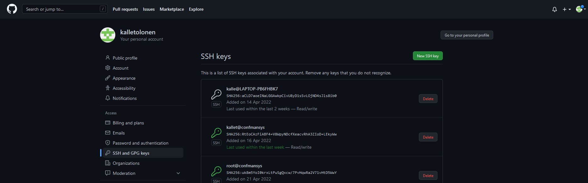

# **h3 Versionhallinta / Managing versions**

I started @ 16.47.
  
The source for the exercise [h4](https://terokarvinen.com/2021/configuration-management-systems-2022-spring/#h4-aikajana)
  
**Hardware & Software**  
*Win 11 + VirtualBox 6.0 + Debian 11 Bullseye*  
  
*Hardware:*  
*CPU: AMD Ryzen 9 5900HS*  
*Mem: 16 Gt LPDDR4X*  
*Storage: 512 Gt M.2 2230 NVMe PCIe 3.0 SSD*  
  
##  a) Captain obvious. Linuxissa on paketinhallinta, joten ohjelmien asentaminen on yksinkertaista. Tee tila, joka asentaa 10 suosikkiohjelmaasi paketinhallinnasta. Tässä a-kohdassa voit jättää ohjelmat oletusasetuksille. / Make a Salt State that will install 10 of my favourite programs

I already did this exercise in my [previous article](https://github.com/kalletolonen/ConfManSystems/blob/main/h3.md).

### Installed programs

	- Micro
	- bash-completion
	- Gimp
	- Blender
	- Python3
	- Apache2
	- Pwgen
	- SSH
	- Git
	- Ufw

**The state**

	micro:
	  pkg.installed
	
	/home/kallet/.config/micro/:
	  file.directory
	
	/home/kallet/.config/micro/settings.json:
	  file.managed:
	    - source: salt://desktop/settings.json
	
	bash-completion:
	  pkg.installed
	
	gimp:
	  pkg.installed
	
	blender:
	  pkg.installed
	
	python3:
	  pkg.installed
	
	apache2:
	  pkg.installed
	
	pwgen:
	  pkg.installed
	  
	ssh:
	  pkg.installed
	
	git:
	  pkg.installed
	
	/home/kallet/.gitconfig:
	  file.managed:
	    - source: salt://desktop/.gitconfig
	
	ufw:
	  pkg.installed
	
	/etc/ufw/user.rules:
	  file.managed:
	    - source: salt://desktop/user.rules
	
	ufw enable:
	  cmd.wait:
	    - watch:
	      - pkg: ufw

For the sake of practice, I installed everything from scratch. You can find my up-to-date personal state for desktop use here: 
https://github.com/kalletolonen/desktop

First I made a clone of my empty Virtualbox, that had Debian 11 & Guest Additions installed. After that I installed Git, Salt and SSH manually to get things rolling:

	sudo apt-get update
	sudo apt-get install -y git ssh salt-master

After that I needed to generate a new public SSH-key for my new machine and add that to Github.

	ssh-keygen

  
*The key was added: settings -> SSH/GPG Keys*

Then I cloned my repo that contained my state (while in my home directory).  	
	git clone git@github.com:kalletolonen/desktop.git

That resulted in an error message.

	git clone git@github.com:kalletolonen/desktop.git
	Cloning into 'desktop'...
	The authenticity of host 'github.com (140.82.121.3)' can't be established.
	ECDSA key fingerprint is SHA256:p2QAMXNIC1TJYWeIOttrVc98/R1BUFWu3/LiyKgUfQM.
	Are you sure you want to continue connecting (yes/no/[fingerprint])? 
	Host key verification failed.
	fatal: Could not read from remote repository.
	
	Please make sure you have the correct access rights
	and the repository exists.

Next I pasted my public key again just to be sure I had pasted it correctly and executed the cloning again.

The same error persisted and I quit work @ 18.59.

I started @ around 9.15.

I managed to clone the repository with https.

	git clone https://github.com/kalletolonen/desktop.git

Next I made a directory for my state.

	sudo systemctl start salt-master
	sudo mkdir /srv/salt
	sudo mkdir /srv/salt/desktop
	sudo cp * /srv/salt/desktop/

After that I executed my state

	sudo salt-call --local state.apply desktop

I had an error message about my .gitconfig-file

```
          ID: /home/kallet/.gitconfig
    Function: file.managed
      Result: False
     Comment: Source file salt://desktop/.gitconfig not found in saltenv 'base'
     Started: 09:28:28.660167
    Duration: 1.28 ms
     Changes:   
```

I think that must have just forgotted to add that to my repository, so I did just that on the computer that had the correct .gitconfig.

	sudo find -iname ".gitconfig" |grep git

```
./srv/salt/desktop/.gitconfig
./var/cache/salt/minion/files/base/desktop/.gitconfig
./home/kallet/desktop/.gitconfig
./home/kallet/.gitconfig
```

The printout told me 2 things:

1. I had the correct file in my repository's directory
2. Git might not allow to sync it's own settings files?

I wanted to find out which it was, so I tried to push and pull the repo.

	cd
	cd desktop
	git pull
	git push

```
Already up to date.
kallet@confmansys:~/desktop$ git push
Everything up-to-date
kallet@confmansys:~/desktop$ ls -a
.  ..  .git  .gitconfig  init.sls  settings.json  user.rules

```

That would indicate that Git doesn't want to sync dotfiles. That turned out to be wrong, as I checked my new machine's directory's contents.

	ls -a

```
.  ..  .git  .gitconfig  init.sls  settings.json  user.rules
kallet@confmansys:~/desktop/desktop$ cat .gitconfig 
[user]
	email = kalle.tolonen@gmail.com
	name = Kalle Tolonen
```

So the next logical thing was to check if my state directory had the file in question, and sure enough, it didn't.

	ls -a /srv/salt/desktop/

```
kallet@confmansys:~/desktop/desktop$ ls -a /srv/salt/desktop/
.  ..  init.sls  settings.json  user.rules
```

So my mistake was using the *-parameter with cp, as it clearly doesn't copy dotfiles. Some [googling](https://superuser.com/questions/61611/how-to-copy-with-cp-to-include-hidden-files-and-hidden-directories-and-their-con) later I decided to try out copying with the recursive flag.

	sudo cp -r . /srv/salt/desktop/

```
kallet@confmansys:~/desktop/desktop$ ls -a /srv/salt/desktop/
.  ..  .git  .gitconfig  init.sls  settings.json  user.rules
```

After that I ran the state again.

```
Summary for local #1st run
-------------
Succeeded: 15 (changed=1)
Failed:     0
-------------
Total states run:     15
Total run time:  177.098 ms
```

``` 
Summary for local #2nd run
-------------
Succeeded: 15
Failed:     0
-------------
Total states run:     15
Total run time:  156.855 ms
```

That was the scope of the assingment, but I wanted to test out if I could push some changes to my repository, since it's quite important to be able to edit and push stuff on multiple computers. To do that I deleted my https-downloaded repo and started over.

	sudo rm -r desktop
	ssh-keygen
	#pasted the key to Github
	#deleted the old SSH-key that had an identical "kallet@confmansys"-id
	git clone git@github.com:kalletolonen/desktop.git

That worked as it should've, so you should never use cloned virtual machines and same username/hostname combos with SSH and Git to avoid this problem.

```
Cloning into 'desktop'...
Warning: Permanently added the ECDSA host key for IP address '140.82.121.3' to the list of known hosts.
remote: Enumerating objects: 27, done.
remote: Counting objects: 100% (27/27), done.
remote: Compressing objects: 100% (20/20), done.
Receiving objects: 100% (27/27), done.
Resolving deltas: 100% (13/13), done.
remote: Total 27 (delta 13), reused 20 (delta 6), pack-reused 0
```

I stopped work @ 10.18.

## b) CSI Pasila. Tiedostoista saa aikajanan 'cd /etc/; sudo find -printf '%T+ %p\n'|sort|tail'. / Using Find


###  Anna esimerkki aikajanasta / Provide an example of timeline

I started in the etc-directory:

	cd /etc/
	sudo find -printf '%T+ %p\n'|sort|tail

```
2022-04-23+09:28:30.4093983320 ./rc1.d
2022-04-23+09:28:30.4093983320 ./rc1.d/K01ufw
2022-04-23+09:28:30.4093983320 ./rcS.d
2022-04-23+09:28:30.4093983320 ./rcS.d/S01ufw
2022-04-23+09:28:30.7332363050 ./systemd/system/multi-user.target.wants
2022-04-23+09:28:30.7332363050 ./systemd/system/multi-user.target.wants/ufw.service
2022-04-23+09:28:31.2569742610 ./ufw
2022-04-23+09:28:31.3209422560 ./ufw/ufw.conf
2022-04-23+09:28:31.4049002490 ./ufw/user6.rules
2022-04-23+09:28:31.4049002490 ./ufw/user.rules
```

### Selitä jokainen kohta komennosta, jolla aikajana tehdään. Vinkki: '%T+' löytyy 'man find' kohdasta printf. /Explain the printout

Used flags:

	-printf -> After this you can format the printout
	-'' is for the definitions of the printout
	-%T+ is for 24 hour time, date separated by +
	-%p is for filename
	-\n defines a newline
	-|sort takes the previous command as input
	-|tail shows the tail end of the sort


###  Aja jokin komento, joka muuttaa järjestelmän yhteisiä asetustiedostoja / Change system settings

I changed the firewall settings:

	sudo ufw allow 80/tcp

```
kallet@confmansys:/etc$ sudo ufw allow 80/tcp
Rule added
Rule added (v6)
```

### Ota uusi aikajana ja etsi muutos sieltä / Search for the changes in timeline

I executed a find command to search for changed files and iterated it's contents:

	sudo find -printf '%T+ %p\n'|sort|tail
	
```
2022-04-23+09:28:30.4093983320 ./rc1.d
2022-04-23+09:28:30.4093983320 ./rc1.d/K01ufw
2022-04-23+09:28:30.4093983320 ./rcS.d
2022-04-23+09:28:30.4093983320 ./rcS.d/S01ufw
2022-04-23+09:28:30.7332363050 ./systemd/system/multi-user.target.wants
2022-04-23+09:28:30.7332363050 ./systemd/system/multi-user.target.wants/ufw.service
2022-04-23+09:28:31.2569742610 ./ufw
2022-04-23+09:28:31.3209422560 ./ufw/ufw.conf
2022-04-23+12:59:13.7841515180 ./ufw/user.rules
2022-04-23+12:59:13.7921555180 ./ufw/user6.rules
```

The printout suggested a fresh timestamp on my settings. The command had changed 2 files (shown above as the 2 last items).

	sudo cat ./ufw/user.rules |grep 80

```
### tuple ### allow tcp 80 0.0.0.0/0 any 0.0.0.0/0 in
-A ufw-user-input -p tcp --dport 80 -j ACCEPT
```

	sudo cat ./ufw/user6.rules |grep 80

The printout was the same. I had no idea why ufw needed 2 diffent files for it's settings. I did some [searching](https://wiki.ubuntu.com/UncomplicatedFirewall) and I think that maybe it's because the rule was added via command line input:

*/var/lib/ufw/user[6].rules or /lib/ufw/user[6].rules (0.28 and later): rules added via the ufw command (should not normally be edited by hand) *  

To try this out, I deleted the settings and executed my salt state once more and checked the situation with find. 

	sudo rm /etc/ufw/user*
	sudo salt-call --local state.apply desktop
	sudo find -printf '%T+ %p\n'|sort|tail

```
2022-04-23+09:28:30.2734663430 ./ufw/before.init
2022-04-23+09:28:30.4093983320 ./rc1.d
2022-04-23+09:28:30.4093983320 ./rc1.d/K01ufw
2022-04-23+09:28:30.4093983320 ./rcS.d
2022-04-23+09:28:30.4093983320 ./rcS.d/S01ufw
2022-04-23+09:28:30.7332363050 ./systemd/system/multi-user.target.wants
2022-04-23+09:28:30.7332363050 ./systemd/system/multi-user.target.wants/ufw.service
2022-04-23+09:28:31.3209422560 ./ufw/ufw.conf
2022-04-23+13:11:28.9705960490 ./ufw/user.rules
2022-04-23+13:11:28.9745940490 ./ufw
```

The salt state had altered 1 file and 1 directory - user.rules and ufw-directory. I checked the status of ufw and realized that I had been wrong.

```
kallet@confmansys:/etc/ufw$ sudo ufw enable
ERROR: Couldn't stat '/etc/ufw/user6.rules'
```

This told me that ufw needed user6.rules to function. I decided to just copy my rules to a different name and give it a go.

	sudo cp user.rules user6.rules
	sudo ufw enable

```
Firewall is active and enabled on system startup
```

So, still it was a mystery for me why UFW needs 2 different config files. I decided to delete my own file and see what would happen. 

	sudo rm user.rules
	sudo ufw reload

```
ERROR: Couldn't stat '/etc/ufw/user.rules'
```

UFW apparently needs 2 identical configuration files to function. 

```
kallet@confmansys:/etc/ufw$ sudo cp user6.rules user.rules
kallet@confmansys:/etc/ufw$ sudo ufw reload
Firewall reloaded
kallet@confmansys:/etc/ufw$ sudo ufw status
Status: active

To                         Action      From
--                         ------      ----
22                         ALLOW       Anywhere                  
22 (v6)                    ALLOW       Anywhere (v6)  
```

## c) Tiedän mitä teit viime kesän^H^H^H komennolla. Säädä jotain ohjelmaa ja etsi sen muuttamat tiedostot aikajanasta. Tee sitten tästä oma Saltin tila.

I decided to update my Micro settings. First I needed to change some settings to my preferences, so I opened Micro and pressed ctrl + e.

	set colorscheme simple
	set softwrap on
	set tabstospaces off
	set ftoptions off


*Micro gave an error message*

That told me that I had something screwed up in my micro settings already, since they were copied from somewhere else and had the wrong user rights.
	ls -l .config/micro/settings.json

```
-rw-r--r-- 1 root root 77 23. 4. 09:27 .config/micro/settings.json
```

Root was the user that had rights, and group & other didn't have rights for anything except reading.

	sudo chown kallet:kallet .config/micro/settings.json
	ls -l .config/micro/settings.json

```
-rw-r--r-- 1 kallet kallet 77 23. 4. 09:27 .config/micro/settings.json
```

I tried to change the settings in Micro once more and this time it worked fine. To find out where the settings were stored, I executed a find command.

	sudo find -printf '%T+ %p\n'|sort|tail

```
2022-04-23+13:41:59.5908285850 ./.config/micro/settings.json
```

This told me the right file to copy to my salt state repo location.

	sudo cp ./.config/micro/settings.json /home/kallet/desktop/

Then I checked my Salt state for a command to move the file to a desired location.

	cd
	cd desktop
	micro init.sls

```SaltStack
/home/kallet/.config/micro/settings.json:
  file.managed:
    - source: salt://desktop/settings.json
```

After this I copied my Salt state to my Salt directory and applied the state.

	sudo cp * /srv/salt/desktop/
	sudo salt-call --local state.apply desktop

```
----------
          ID: /home/kallet/.config/micro/settings.json
    Function: file.managed
      Result: True
     Comment: File /home/kallet/.config/micro/settings.json updated
     Started: 13:51:46.755257
    Duration: 20.546 ms
     Changes:   
              ----------
              diff:
                  --- 
                  +++ 
                  @@ -1,5 +1,6 @@
                   {
                       "colorscheme": "simple",
                       "ftoptions": false,
                  -    "softwrap": true
                  +    "softwrap": true,
                  +	"tabstospaces": false
                   }
```

This proved that the settings had been updated.

If I hadn't already known where Micro's settings were, I could have checked that (after modding them manually) with:

	sudo find -printf '%T+ %p\n'|sort|tail

## d) Asenna jokin toinen ohjelma asetuksineen. / Install something else with custom settings. 

I wanted to install a program for making screen caps, since my laptop's keyboard isn't working with fn+printscreen in Linux. 

	sudo apt-cache search screen |grep cap

```
kde-spectacle - Screenshot capture utility
late - simple game of capturing balls
libgd-securityimage-perl - security image (captcha) generator
libterm-extendedcolor-perl - module to color screen output using extended escape sequences
python3-blessed - Thin, practical wrapper around terminal capabilities in Python3
scrot - command line screen capture utility

```

Next I installed kde-spectacle and scrot both.

	sudo apt-get install -y kde-spectacle scrot

```
kallet@confmansys:~/desktop$ kde-spectacle
bash: kde-spectacle: command not found
```

kde-spectacle didn't do anything, so it's probably just some kde-desktop add on? Scrot did take a simple screenshot.

	scrot '1.png' -e 'mv $f ~/'

This command takes a screenshot, and moves it to $HOME. By now, it was quite clear to me that Scrot didn't actually have any permanent settings to customize. I still decided to add it to my state by editing init.sls.

	cd
	cd desktop
	micro init.sls


```
scrot:
  pkg.installed
#scrot '1.png' -e 'mv $f ~/'
```
	
	sudo cp * /srv/salt/desktop/

Next I decided to mod Gimp's settings. I wanted to make the default export directory something sensible. I had Gimp already installed. After Googling it became obvious that this isn't an option that Gimp provides, you can only provide a list of [folders](https://www.sl-inspiration.com/2017/05/how-to-add-default-export-or-save.html).

So, to try something else out, I had to look for software that I might use. I decided to give VLC a try. 

	sudo apt-get install -y vlc

I changed a setting and it didn't change anything in /etc.

```
kallet@confmansys:/etc$ sudo find -printf '%T+ %p\n'|sort|tail
2022-04-23+13:20:29.2403260320 ./ufw/user.rules
2022-04-23+13:58:27.9063247030 ./signon-ui
2022-04-23+13:58:33.4290847050 ./xdg/menus
2022-04-23+13:58:33.6331867060 ./xdg/ui
2022-04-23+13:58:35.0418907060 ./xdg
2022-04-23+13:58:35.2059727050 ./xdg/autostart
2022-04-23+13:58:35.2259827060 ./signon-ui/webkit-options.d
2022-04-23+14:37:31.1782055830 ./mailcap
2022-04-23+14:37:31.2301795830 ./ld.so.cache
2022-04-23+14:37:31.2341775840 .
kallet@confmansys:/etc$ sudo find -printf '%T+ %p\n'|sort|tail
2022-04-23+13:20:29.2403260320 ./ufw/user.rules
2022-04-23+13:58:27.9063247030 ./signon-ui
2022-04-23+13:58:33.4290847050 ./xdg/menus
2022-04-23+13:58:33.6331867060 ./xdg/ui
2022-04-23+13:58:35.0418907060 ./xdg
2022-04-23+13:58:35.2059727050 ./xdg/autostart
2022-04-23+13:58:35.2259827060 ./signon-ui/webkit-options.d
2022-04-23+14:37:31.1782055830 ./mailcap
2022-04-23+14:37:31.2301795830 ./ld.so.cache
2022-04-23+14:37:31.2341775840 .
```

So, I went to / and issues a similar command:

	sudo find -printf '%T+ %p\n'|sort|grep vlc

```
2022-04-23+14:43:10.4819450160 ./home/kallet/.config/vlc/vlc-qt-interface.conf
```	

This gave me a good candidate for the settings.

	micro /home/kallet/.config/vlc/vlc-qt-interface.conf

The resulting config wasn't easy to read, so I made a copy of it and made the same change in reverse to figure the changes by taking a diff.

	cp /home/kallet/.config/vlc/vlc-qt-interface.conf /home/kallet/.config/vlc/vlc-qt-interface2.conf
	#made the change in GUI
	diff /home/kallet/.config/vlc/vlc-qt-interface.conf /home/kallet/.config/vlc/vlc-qt-interface2.conf

Diff gave me nothing, so next I tried it out on a diffent file to make sure I was using it in a correct manner. 

```
diff -d /home/kallet/.config/vlc/vlc-qt-interface.conf /home/kallet/.config/vlc/vlcrc |tail
> 
> # Playlist bookmark 9 (string)
> #bookmark9=
> 
> # Playlist bookmark 10 (string)
> #bookmark10=
22,24d5120
< [RecentsMRL]
< list=@Invalid()
< times=@Invalid()
```

That demostrated to me that the fault wasn't with diff.

I ended the day @ 15.55
