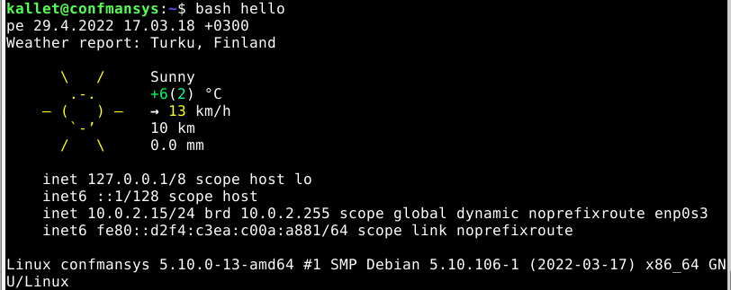
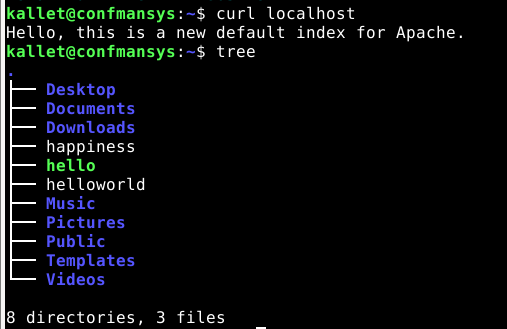

# **h5 h5 Uusi komento / New command**

I started @ 13.08..
  
The source for the exercise [h5](https://terokarvinen.com/2021/configuration-management-systems-2022-spring/#h5-uusi-komento)
  
**Hardware & Software**  
*Win 11 + VirtualBox 6.0 + Debian 11 Bullseye*  
  
*Hardware:*  
*CPU: AMD Ryzen 9 5900HS*  
*Mem: 16 Gt LPDDR4X*  
*Storage: 512 Gt M.2 2230 NVMe PCIe 3.0 SSD*  
  
## a)  Hei komento! Tee järjestelmään uusi "hei maailma" -komento ja asenna se orjille Saltilla. Liitä raporttiisi 'ls -l /usr/local/bin/' tulosteesta ainakin se rivi, jolla näkyy uuden komentotiedostosi oikeudet. Vinkkejä: tee shell script, joka tulostaa "hei maailma". Kokeile ensin käsin, sitten automatisoi. Luonteva paikka paketinhalllinnan ulkopuolelta asennetuille ohjelmille on /usr/local/bin/. Katso myös 'salt-call --local sys.state_doc file.managed'. Muista (aina ja kaikessa mitä teet tietokoneella) testata lopputulos. Hyvä testi on mahdollisimman lähellä sitä, mitä käyttäjä tekisi. / Make a new "hello world"-style command and install it to minions

First I started by cloning my base virtual machine in VirtualBox. The machine had just Debian 11 and Guest Additions installed, so that I could copy & paste efficiently.  

  
*Right click -> Clone -> Full Clone*

To make a Salt state for minions you need salt-minion and salt-master pkgs, so I installed those first (and bash-completion to keep myself sane):

	sudo apt-get update
	sudo apt-get install -y salt-master salt-minion bash-completion

Next, I checked that Salt was properly installed and pressed tab to check for bash-completion too (bash-completion completes bash commands with tab):

	salt --version

```
salt 3002.6
```

After that the next logical thing was to try out a Salt state locally with a file.managed function, that checks for a file and creates it, if it isn't already in existance. Salt states reside in /srv/salt/nameofstate, so for this I needed to create a directory that would house my state.

	sudo mkdir /srv/salt/helloworld/

That resulted in an error.
```
mkdir: cannot create directory ‘/srv/salt/helloworld/’: No such file or directory
```

That was propably due to the non-existant salt-directory, so I tried if mkdir would accept a recursive flag. To find out the correct flag, I checked the help.

	mkdir --help

```
kallet@confmansys:~$ mkdir --help
Usage: mkdir [OPTION]... DIRECTORY...
Create the DIRECTORY(ies), if they do not already exist.

Mandatory arguments to long options are mandatory for short options too.
  -m, --mode=MODE   set file mode (as in chmod), not a=rwx - umask
  -p, --parents     no error if existing, make parent directories as needed
  -v, --verbose     print a message for each created directory
  -Z                   set SELinux security context of each created directory
                         to the default type
      --context[=CTX]  like -Z, or if CTX is specified then set the SELinux
                         or SMACK security context to CTX
      --help     display this help and exit
      --version  output version information and exit

GNU coreutils online help: <https://www.gnu.org/software/coreutils/>
Full documentation <https://www.gnu.org/software/coreutils/mkdir>
or available locally via: info '(coreutils) mkdir invocation'
```

Then it was time to try out the command with the right flag.

	sudo mkdir -p /srv/salt/helloworld/
	ls /srv/salt/

And fair enough, there was my directory.

```
kallet@confmansys:~$ ls /srv/salt/
helloworld
```

Now I had the directory, so then I wanted to create a file.
	
	sudoedit /srv/salt/helloworld/init.sls


```SaltStack
/tmp/helloworld:
  file.managed
```

Then I tested out my state.

	sudo salt-call --local state.apply helloworld
	
```
             new:
                  file /tmp/helloworld created

Summary for local
------------
Succeeded: 1 (changed=1)
Failed:    0
------------
Total states run:     1
Total run time:   6.595 ms
```

To check for idempotency, I ran the state again.

	sudo salt-call --local state.apply helloworld

```
Summary for local
------------
Succeeded: 1
Failed:    0
------------
Total states run:     1
Total run time:   6.130 ms
```

No changes validated my case, so I knew how to check for a file and make sure it was where it was supposed to be. The next thing was to make the shell script to print out "Hello World". [Source](https://www.cyberciti.biz/faq/hello-world-bash-shell-script/).

	nano helloworld

```shellscript
!/usr/bin/bash

echo "Hello World!"
```

```
kallet@confmansys:~$ bash helloworld 
Hello World!
```

That worked out, so then I needed to put the file in the correct folder for execution.

	sudo cp helloworld /usr/local/bin/

Then I tried it out and figured that I would need to change user rights.

```
kallet@confmansys:~$ helloworld
bash: /usr/local/bin/helloworld: Permission denied
kallet@confmansys:~$ ls -l /usr/local/bin/helloworld 
-rw-r--r-- 1 root root 37 29. 4. 13:55 /usr/local/bin/helloworld
```

To change to user rights I used chmod to allow execution for everybody.

	sudo chmod ugo+x /usr/local/bin/helloworld

```
kallet@confmansys:~$ ls -l /usr/local/bin/helloworld 
-rwxr-xr-x 1 root root 37 29. 4. 13:55 /usr/local/bin/helloworld
```

	helloworld

The prinout suggested that I had succeeded.

```
Hello World!
```

### Copying the script to a salt-master server's folder

Salt uses it's master's state directory as a location to deal out files to minions, so I had to relocate my file there.

	sudo cp /usr/local/bin/helloworld /srv/salt/helloworld/

Next I needed to modify my state in a suitable manner.

	sudoedit /srv/salt/helloworld/init.sls
	
```SaltStack
/usr/local/bin/helloworld:
  - file.managed:
    - source: salt://helloworld/helloworld
```

I had made a mistake:
```
kallet@confmansys:~$ sudo salt-call --local state.apply helloworld
local:
    Data failed to compile:
----------
    ID /usr/local/bin/helloworld in SLS helloworld is not a dictionary
```

So, I fixed my state. I also renamed the bash file to .sh-type.

	sudo mv /srv/salt/helloworld/helloworld /srv/salt/helloworld/helloworld.sh

```SaltStack
/usr/local/bin/helloworld.sh:
  - file.managed:
    - source: salt://helloworld/helloworld.sh
```

The same error persisted. I checked my desktop-state for reference and sure enough, there was a difference.

```SaltStack
/usr/local/bin/helloworld.sh:
  file.managed:
    - source: salt://helloworld/helloworld.sh
```

This time around it worked like a charm.
```
kallet@confmansys:~$ sudo salt-call --local state.apply helloworld
local:
----------
          ID: /usr/local/bin/helloworld.sh
    Function: file.managed
      Result: True
     Comment: File /usr/local/bin/helloworld.sh updated
     Started: 14:15:46.095921
    Duration: 24.144 ms
     Changes:   
              ----------
              diff:
                  New file
              mode:
                  0644

Summary for local
------------
Succeeded: 1 (changed=1)
Failed:    0
------------
Total states run:     1
Total run time:  24.144 ms
```

I modified my state and made my file lose it's file extension, since it was not needed. 
	
	sudo mv /srv/salt/helloworld/helloworld.sh /srv/salt/helloworld/helloworld

```SaltStack
/usr/local/bin/helloworld:
  file.managed:
    - source: salt://helloworld/helloworld
```

Then I checked the octal number user rights and removed the manually moved file.
	
	stat /usr/local/bin/helloworld
	sudo rm /usr/local/bin/helloworld
	

```
  File: /usr/local/bin/helloworld
  Size: 37        	Blocks: 8          IO Block: 4096   regular file
Device: fd00h/64768d	Inode: 2243049     Links: 1
Access: (0755/-rwxr-xr-x)  Uid: (    0/    root)   Gid: (    0/    root)
```

755 was my desired state for user rights, so I added those to my state.

	sudoedit /srv/salt/helloworld/init.sls

```SaltStack
/usr/local/bin/helloworld:
  file.managed:
    - source: salt://helloworld/helloworld
    - user: root
    - group: root
    - mode: 755
```

Next I executed my state.

	sudo salt-call --local state.apply helloworld

```
     Changes:   
              ----------
              diff:
                  New file
              mode:
                  0755

Summary for local
------------
Succeeded: 1 (changed=1)
Failed:    0
------------
Total states run:     1
Total run time:  23.294 ms
```

And checked for idempotency by running it again.

```
Summary for local
------------
Succeeded: 1
Failed:    0
------------
Total states run:     1
Total run time:  23.855 ms
```

The only test left for the state was to check if the script would run and to take a peek on the user rights.	

```
kallet@confmansys:~$ helloworld 
Hello World!
kallet@confmansys:~$ ls -l /usr/local/bin/helloworld
-rwxr-xr-x 1 root root 37 29. 4. 14:25 /usr/local/bin/helloworld
```
	
### How to install the state to minions

In order for me to have a minion, I started the minion service locally. For that to happen I needed the hostname/domain of my master.

	hostname -I

```
10.0.2.15
```

	sudoedit /etc/salt/minion

```
master: 10.0.2.15
#Just added this line to the file's beginning.
```

	sudo systemctl restart salt-minion
	sudo systemctl start salt-master.service
	sudo salt-key -A confmansys

  
*The key was accepted*  

```
kallet@confmansys:~$ sudo salt '*'  test.ping
confmansys:
    True
```

The slave was up, taking orders and responsive. 

	sudo salt '*' state.apply helloworld

Since the state was locally applied, the file was already in place, so I removed it, executed the state again and ran the shell script.

	sudo rm /usr/local/bin/helloworld
	sudo salt '*' state.apply helloworld
	helloworld

```
Summary for confmansys
------------
Succeeded: 1 (changed=1)
Failed:    0
------------
Total states run:     1
Total run time:  19.423 ms
kallet@confmansys:~$ helloworld 
Hello World!
```

I decided to try out Salt on my linux server in Germany, so I logged in there with SSH.

	sudo apt-get install -y ssh
	ssh user@ip
	#type yes, if you don't have a ssh authentication with a hash to apply password login

Then I installed salt-minion.

	sudo apt-get update
	sudo apt-get install -y salt-minion
	sudoedit /etc/salt/minion

```
master: 10.0.2.15
#just added this to the file
```
	
	sudo systemctl restart salt-minion
	#Opened another terminal on my salt-master
	sudo salt-key

That didn't show any keys, so I figured that this must be a thing of VirtualBox trickery, since the IP is not a real world address. I decided to reverse the roles and made my German server the master of my local VM. I added the ip-address of my German server to my local minion file.

	sudoedit /etc/salt/minion

```
master: 164.92.210.228
```

	sudo apt-get install -y salt-master
	#On the German Linux
	sudo systemctl restart salt-minion
	#On the local VM

	sudo systemctl start salt-master.service
	
	#On the German Master
	sudo salt-key

```
No luck

sukalle@Fenix:~$ sudo salt-key
Accepted Keys:
Denied Keys:
Unaccepted Keys:
Rejected Keys:
```

I did another test with a locally installed minion-master pair @ my server, and confirmed that there wasn't anything wrong with the server inherently.

```
sukalle@Fenix:~$ sudo salt-key
Accepted Keys:
Denied Keys:
Unaccepted Keys:
Fenix
Rejected Keys:
sukalle@Fenix:~$ sudo salt-key -A Fenix
The following keys are going to be accepted:
Unaccepted Keys:
Fenix
Proceed? [n/Y] Y
Key for minion Fenix accepted.
sukalle@Fenix:~$ sudo salt '*' test.ping
Fenix:
    True
sukalle@Fenix:~$ 
```
	
## b) whatsup.sh. Tee järjestelmään uusi komento, joka kertoo ajankohtaisia tietoja; asenna se orjille. Vinkkejä: Voit näyttää valintasi mukaan esimerkiksi päivämäärää, säätä, tietoja koneesta, verkon tilanteesta... / Make a usefull command for minions

I searched for a weather utility, and found out that Debian [had one solution](https://ostechnix.com/check-weather-details-command-line-linux/) installed. I was already familiar with date-command, so that left me to figure out good commands for network & computer info. 

### The commands
	
	curl wttr.in?0 	#For local  weather

```
kallet@confmansys:~$ curl wttr.in?0
Weather report: Turku, Finland

      \   /     Sunny
       .-.      +6(2) °C       
    ― (   ) ―   → 13 km/h      
       `-’      10 km          
      /   \     0.0 mm
````
	
	date			#For local time

```
kallet@confmansys:~$ date
pe 29.4.2022 16.44.12 +0300
```
	
	ip a 			#For network info
	
```
kallet@confmansys:~$ ip a
1: lo: <LOOPBACK,UP,LOWER_UP> mtu 65536 qdisc noqueue state UNKNOWN group default qlen 1000
    link/loopback 00:00:00:00:00:00 brd 00:00:00:00:00:00
    inet 127.0.0.1/8 scope host lo #NETWORK ADAPTER AND IP
       valid_lft forever preferred_lft forever
    inet6 ::1/128 scope host 
       valid_lft forever preferred_lft forever 
2: enp0s3: <BROADCAST,MULTICAST,UP,LOWER_UP> mtu 1500 qdisc pfifo_fast state UP group default qlen 1000
    link/ether 08:00:27:4a:9a:f0 brd ff:ff:ff:ff:ff:ff
    inet 10.0.2.15/24 brd 10.0.2.255 scope global dynamic noprefixroute enp0s3 #NETWORK ADAPTER AND IP
       valid_lft 74213sec preferred_lft 74213sec
    inet6 fe80::d2f4:c3ea:c00a:a881/64 scope link noprefixroute 
       valid_lft forever preferred_lft forever
```
	
	uname -a 		#For HW-info

```
kallet@confmansys:~$ uname -a
Linux confmansys 5.10.0-13-amd64 #1 SMP Debian 5.10.106-1 (2022-03-17) x86_64 GNU/Linux
```
	
The printout for uname needed some explaining, so [I googled it](https://linuxize.com/post/uname-command-in-linux/).

| Syntax | Description |
| ----------- | ----------- |
| Linux | Kernel name  |
| confmansys | Hostanme | 
| 5.10.0-13-amd64 | Kernel release | 
| #1 SMP Debian 5.10.106-1 (2022-03-17) | Kernel hardware name | 
| x86_64 | Machine hardware name |
| GNU/Linux | Operating system name |

Now I had my commands, so next I needed to pack them into a shell script to run them all with a single comman.

	sudo apt-get install -y micro
	micro hello

```shellscript
#!/usr/bin/bash

date
curl wttr.in?0
echo ""
ip a |grep inet
echo ""
uname -a
```
	
	bash hello

  
*My printout looked reasonably good*  

I quit @ 17.05.

Resumed work @ 18.48.

Next it was time to rinse & repeat the previous part of this exercise and move the file to the right directory, make a Salt state for it with proper user rights and test it out.

	sudo cp hello /usr/local/bin/
	sudo chmod ugo+x hello /usr/local/bin/hello
	hello

  
*The script worked as intended*  

Next, I made a directory for the Salt state and the state itself.

	sudo mkdir /srv/salt/hello/
	sudo cp hello /srv/salt/hello/
	sudo micro /srv/salt/hello/init.sls

```SaltStack
/usr/local/bin/hello:
  file.managed:
    - source: salt://hello/hello
    - user: root
    - group: root
    - mode: 755
```

For the test I removed the manually added file, executed my state 2 times and then executed my command.

	sudo rm /usr/local/bin/hello
	sudo salt '*' state.apply hello #this twice

```
confmansys:
----------
          ID: /usr/local/bin/hello
    Function: file.managed
      Result: True
     Comment: File /usr/local/bin/hello is in the correct state
     Started: 19:02:49.154489
    Duration: 20.041 ms
     Changes:   

Summary for confmansys
------------
Succeeded: 1
Failed:    0
------------
Total states run:     1
Total run time:  20.041 ms
```


	hello

  
*It's always sunny in Turku*  

## c) c) hello.py. Tee järjestelmään uusi komento Pythonilla ja asenna se orjille. Vinkkejä: Hei maailma riittää, mutta propellihatut saavat toki koodaillakin. Shebang on "#!/usr/bin/python3". Helpoin Python-komento on: print("Hei Tero!") / Make a Python command for minions

Python3 comes with Debian, so I didn't have to install that. I checked the location for Python to include in my shebang-magic.

	which python3
	micro happiness

```python
#!/usr/bin/python3

answer = input("Do you have a problem (y/n)? ")

if answer == "y":
    canYouAct = input("Can you do anything about it (y/n)? ")
    if canYouAct == "n":
        print("Don't worry, be happy!")
    else:
        print("Go fix your problem!")
else:
    print("Good for you!")
```

Then it was just a question of copy & paste from above.

	sudo cp happiness /usr/local/bin/
	sudo chmod ugo+x /usr/local/bin/happiness

```
kallet@confmansys:~$ happiness 
Do you have a problem (y/n)? n
Good for you!
```

After this I did a directory for Salt, a state in the directory, copied my program to the Salt master's file server location, deleted the manually inserted file and executed the state 2 times & tested the outcome.

	sudo mkdir /srv/salt/happy
	sudo cp happiness /srv/salt/happy/
	sudo micro /srv/salt/happy/init.sls

```SaltStack
/usr/local/bin/happiness:
  file.managed:
    - source: salt://happy/happiness
    - user: root
    - group: root
    - mode: 755
```

	sudo rm /usr/local/bin/happiness
	sudo salt '*' state.apply happy
	happiness

  
*My slave was gifted with happiness*  

## d) Laiskaa skriptailua. Tee kansio, josta jokainen skripti kopioituu orjille. Vinkki: 'salt-call --local sys.state_doc file.recurse'. Kun tämä on valmis, on todella helppoa laittaa orjille mikä tahansa yhden tiedoston shell script, Python-ohjelma, Perl-ohjelma, Go-binääri tai muu yhden binäärin ohjelma. / Make a folder containing your scripts and copy those to minions

I started my problem solving by looking into the documentation.

	sudo salt-call --local sys.state_doc file.recurse

I decided to try out and modify an example code for my purposes.

```SaltStack
/srv/stuff/substuf:
              file.directory:
                - user: fred
                - group: users
                - mode: 755
                - makedirs: True
                - recurse:
                  - user
                  - group
                  - mode
```

	sudo mkdir /srv/salt/scriptfolder
	sudo mkdir /srv/salt/scriptfolder/scripts
	sudo micro /srv/salt/scriptfolder/init.sls
	sudo cp happiness hello helloworld /srv/salt/scriptfolder/scripts/

```
/usr/local/bin:
  file.managed:
    - source: salt://scriptfolder/scripts
    - user: root
    - group: root
    - mode: 755
    - recurse:
      - user
      - group
      - mode
```

I could already see from the looks of it that this wouldn't work, but I just wanted to see the error message. 
	
```
confmansys:
----------
          ID: /usr/local/bin
    Function: file.managed
      Result: False
     Comment: Specified target /usr/local/bin is a directory
     Started: 19:38:31.532033
    Duration: 6.084 ms
     Changes:   
```

I changed the function to file.recurse and tried again.

```
confmansys:
----------
          ID: /usr/local/bin
    Function: file.recurse
      Result: False
     Comment: 'mode' is not allowed in 'file.recurse'. Please use 'file_mode' and 'dir_mode'.
     Started: 19:39:55.128912
    Duration: 1.855 ms
     Changes:   
```

Next I tried it out without the mode to see what would happen.

```
Summary for confmansys
------------
Succeeded: 1
Failed:    0
------------
Total states run:     1
Total run time:  45.668 ms
```

```SaltStack
#My new state
/usr/local/bin:
  file.recurse:
    - source: salt://scriptfolder/scripts
    - user: root
    - group: root
    - recurse:
      - user
      - group
```

That worked out, so I needed to figure the user rights out. I don't understand the benefit of the change in function's parameter name for individual files or many files, but the earlier error message told me a solution.

```SaltStack
/usr/local/bin:
  file.recurse:
    - source: salt://scriptfolder/scripts
    - user: root
    - group: root
    - file_mode: 755 #changed this line from "- file: 755"
    - recurse:
      - user
      - group
      - mode
```

To properly test this out, I removed the files from /usr/local/bin, executed my state 2 times and my scripts after that.

	sudo rm /usr/local/bin/*
	sudo salt '*' state.apply scriptfolder

```
     Changes:   
              ----------
              /usr/local/bin/happiness:
                  ----------
                  diff:
                      New file
                  mode:
                      0755
              /usr/local/bin/hello:
                  ----------
                  diff:
                      New file
                  mode:
                      0755
              /usr/local/bin/helloworld:
                  ----------
                  diff:
                      New file
                  mode:
                      0755

Summary for confmansys
------------
Succeeded: 1 (changed=1)
Failed:    0
------------
Total states run:     1
Total run time:  82.894 ms
```

	sudo salt '*' state.apply scriptfolder

```
Summary for confmansys
------------
Succeeded: 1
Failed:    0
------------
Total states run:     1
Total run time:  33.699 ms
```

  
*The scripts executed great*  

As a final check, I listed the user rights for my scripts.

```
kallet@confmansys:~$ ls -l /usr/local/bin/
total 12
-rwxr-xr-x 1 root root 295 29. 4. 19:47 happiness
-rwxr-xr-x 1 root root  78 29. 4. 19:47 hello
-rwxr-xr-x 1 root root  37 29. 4. 19:47 helloworld
```

I quit for the night @ 19.52.

## e) Intel. Etsi kolme loppuprojektia joltain vanhalta kurssitoteutukselta. Kuvaile projektit tiiviisti ja linkitä alkuperäiseeen raporttin. Vinkkejä: Loppuprojekteja löydät etsimällä opiskelijoiden raportteja vanhoilta kursseilta ja selailemalla sivuja, joilta ne löytyivät. Raportteja löytyy vanhojen kurssitotetusten kommenteista. Ja tietysti kannattaa silmäillä listaa sieltä täältä, niin näet eri projektit kuin muut. Voi hakea myös Googlella ja DuckDuckGolla. / Read and review 3 old projects of this course

Started work @ 09.30ish

### First article (in Finnish): [Joni Smolander](https://joni.tech.blog/2020/05/20/ph-h7/)

Smolander decided to find out, if it's possible to control the states to be installed with filters. The filter he used wass the amount of memory. He also installed different web daemons to different slaves. For this, he used top.sls-file as a differentiator. 

According to Smolander, the id for the minion should be  given on the minion-file as a "id: name"-parameter. The file for selecting the states for slaves is /srv/salt/top.sls.

He had some initial troubles with his state, but he eventually triumphed over them. The problem he had was solved by moving the individual state-files to the same directory as top.sls and naming them in the way that he refenreces them in top.sls. **update: It became obvious to me that you don't have to store the files in the same directory as the top.sls file. See the third article & my implementation at the next part of this article for reference**

### Second article (in Finnish): [Markus Saikkonen](https://markussaikkonen.wordpress.com/2020/05/21/7-oma-moduuli-nqinx-virtual-host/)

The article was about installing Nginx and a virtualhost to a slave machine. Saikkonen used file, package and service from Salt to accomplish this. 

### Third article (in Finnish): [Ville Mäntyranta](https://vimlinux.wordpress.com/2020/05/20/harjoitus-7/)

Mäntyranta used Salt to install various programs with a top.sls-file. In the file he selected 3 different states to be installed to every slave machine. He used pkg-file-service in installing and running programs idempotently. 

## e) Lukua, ei luottamusta. Kokeile yhtä kohdassa d-Intel löytämääsi modulia koneella. Tämä on infraa koodina, joten luottamusta ei tarvita. Voit lukea koodista, mitä olet ajamassa. / Try out a peer module from previous course implementations

I wanted to try out a module that used a top.sls-file, so I chose article [3](https://vimlinux.wordpress.com/2020/05/20/harjoitus-7/).

My VM had Salt installed and a minion on the same VM up and running.

```
kallet@confmansys:~$ sudo salt '*'  test.ping
[sudo] password for kallet: 
confmansys:
    True
```

I quit @ 10.11

Started work @ 14.21.

First I made a directory and a file for the Salt state.

	sudo mkdir -p /srv/salt/apache
	sudoedit /srv/salt/apache/init.sls

```SaltStack
apache2:
 pkg.installed
/var/www/html/index.html:
 file.managed:
   - source: salt://apache/default-index.html
/etc/apache2/mods-enabled/userdir.conf:
 file.symlink:
   - target: ../mods-available/userdir.conf
/etc/apache2/mods-enabled/userdir.load:
 file.symlink:
   - target: ../mods-available/userdir.load
apache2service:
 service.running:
   - name: apache2
   - watch:
     - file: /etc/apache2/mods-enabled/userdir.conf
     - file: /etc/apache2/mods-enabled/userdir.load
```

After that I created a default index for Apache.

	sudoedit /srv/salt/apache/default-index.html 

```
Hello, this is a new Apache default site.
```

After this I tried the state out.
	
	sudo salt ‘*’ state.apply apache

```
Summary for confmansys
------------
Succeeded: 5 (changed=5) #1st run
Failed:    0
------------
Total states run:     5
Total run time:   7.799 s
```

```
Summary for confmansys
------------
Succeeded: 5 #2nd run
Failed:    0
------------
Total states run:     5
Total run time:  94.339 ms
```

Just to be sure, I checked the browser.

  
*Localhost output was as expected*  

The tests in the article don't test for userdirs, so neither did I.

Next it was time for sshd.
	
	mkdir /srv/salt/sshd
	sudoedit /srv/salt/sshd/init.sls

```SaltStack
openssh-server:
 pkg.installed
/etc/ssh/sshd_config:
 file.managed:
   - source: salt://sshd/sshd_config
sshd:
 service.running:
   - watch:
     - file: /etc/ssh/sshd_config
```

And next I created a config file for sshd.

	sudoedit sshd_config
	sudoedit /srv/salt/sshd/sshd_config

```
# DON'T EDIT - managed file, changes will be overwritten
Port 8888
Protocol 2
HostKey /etc/ssh/ssh_host_rsa_key
HostKey /etc/ssh/ssh_host_dsa_key
HostKey /etc/ssh/ssh_host_ecdsa_key
HostKey /etc/ssh/ssh_host_ed25519_key
UsePrivilegeSeparation yes
KeyRegenerationInterval 3600
ServerKeyBits 1024
SyslogFacility AUTH
LogLevel INFO
LoginGraceTime 120
PermitRootLogin prohibit-password
StrictModes yes
RSAAuthentication yes
PubkeyAuthentication yes
IgnoreRhosts yes
RhostsRSAAuthentication no
HostbasedAuthentication no
PermitEmptyPasswords no
ChallengeResponseAuthentication no
X11Forwarding yes
X11DisplayOffset 10
PrintMotd no
PrintLastLog yes
TCPKeepAlive yes
AcceptEnv LANG LC_*
Subsystem sftp /usr/lib/openssh/sftp-server
UsePAM yes
```

Then I executed the state.
	
	sudo salt '*' state.apply sshd

```
Summary for confmansys
------------
Succeeded: 3 (changed=2) #1st run (I had a pkg installed already)
Failed:    0
------------
Total states run:     3
Total run time: 144.563 ms
```

```
Summary for confmansys
------------
Succeeded: 3 #2nd run
Failed:    0
------------
Total states run:     3
Total run time:  92.629 ms
```

  
*SSH was working for my server conneciton*  

Next it was time to install Curl & Tree.

    sudo mkdir /srv/salt/programs
    sudoedit /srv/salt/programs/init.sls

```SaltStack
install_network_packages:
  pkg.installed:
    - pkgs:
      - tree
      - curl
```
	
	sudo salt '*' state.apply programs

```
Summary for confmansys
------------
Succeeded: 1 (changed=1) #1st run (Curl was already installed)
Failed:    0
------------
Total states run:     1
Total run time:   2.518 s
```

```
Summary for confmansys
------------
Succeeded: 1 #2nd run
Failed:    0
------------
Total states run:     1
Total run time:  54.078 ms
```

	curl https://www.paiste.fi |grep title

```
 % Total    % Received % Xferd  Average Speed   Time    Time     Time  Current
                                 Dload  Upload   Total   Spent    Left  Speed
  0     0    0     0    0     0      0      0 --:--:-- --:--:-- --:--:--     0  <title>Lounasravintola Paiste</title>
          <h2 class="card-title"><br>Suolakivenkatu</h2>
          <h2 class="card-title"><br>
100 11347  100 11347    0     0   120k      0 --:--:-- --:--:-- --:--:--  119k
```
	
	tree /srv/salt
	

  
*Tree was working*  

The last thing to do was to create the top.sls that contained instructions on what to install to which minion. The source had a faulty syntax (no intendations), so I added those right out of the bat.
	
	sudoedit /srv/salt/top.sls
	
```SaltStack
base:
  '*':
    - apache
    - sshd
    - programs
```

To test the module, I removed all of the files and folders that it referenced to and checked that they were indeed not operational.

	sudo rm /var/www/html/index.html
	sudo systemctl stop apache2.service
	sudo apt-get purge -y apache2*
	sudo rm /etc/ssh/sshd_config
	sudo systemctl stop sshd
	sudo apt-get purge -y ssh*
	sudo apt-get purge -y curl tree
		
**Tests**

	curl
	sudo systemctl start ssh
	sudo systemctl start apache2.service
	tree

  
*The state had been cancelled*  
  
To apply the state again, I executed it.
	
	sudo salt '*' state.highstate

I had missed a spot.

```
----------
          ID: openssh-server
    Function: pkg.installed
      Result: True
     Comment: All specified packages are already installed
     Started: 15:10:12.227259
    Duration: 670.767 ms
     Changes:   
----------
```

Otherwise the state did everything perfectly.

```
Summary for confmansys
------------
Succeeded: 9 (changed=8) #1st run
Failed:    0
------------
Total states run:     9
Total run time:   9.232 s
```

```
Summary for confmansys
------------
Succeeded: 9 #2nd run
Failed:    0
------------
Total states run:     9
Total run time: 147.805 ms
```

To verify the results I curled localhost, used tree and connected to my remote server with ssh.

	curl localhost
	tree
	ssh user@ip

  
*top.sls was implemented to a good use*  

```
Last login: Sun May  1 11:42:05 2022 from 88.192.36.61
sukalle@Fenix:~$ 
```

## f) Palauta linkki raporttiisi Laksuun. / Return your work to the peer review platform of this course

The assingment was returned to the platform.

## g) Anna palaute kahdelle opiskelukaverille Laksussa. (Täsmennys: siis tästä tehtävästä h5) / Give feedback to 2 peers on the platform

I will review 3 peer works after commiting this work to the platform.

I quit @ 16.09 and started the reviews for my peers.
