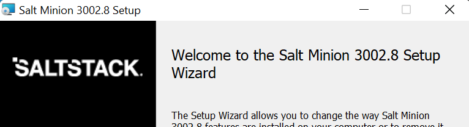
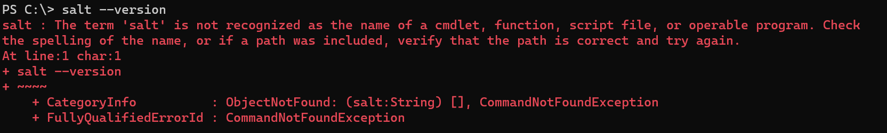
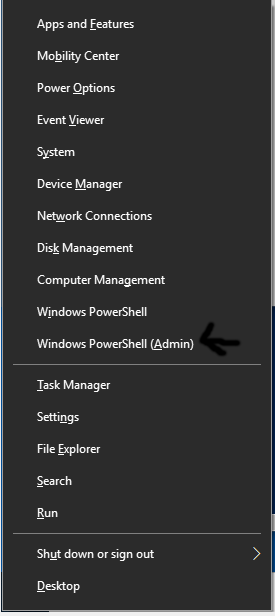
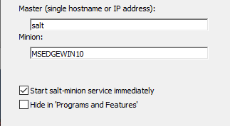
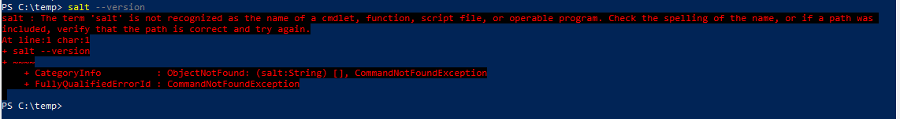
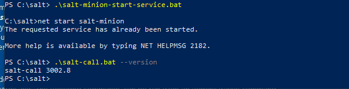
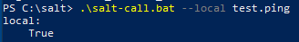
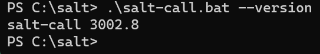
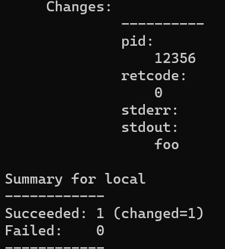
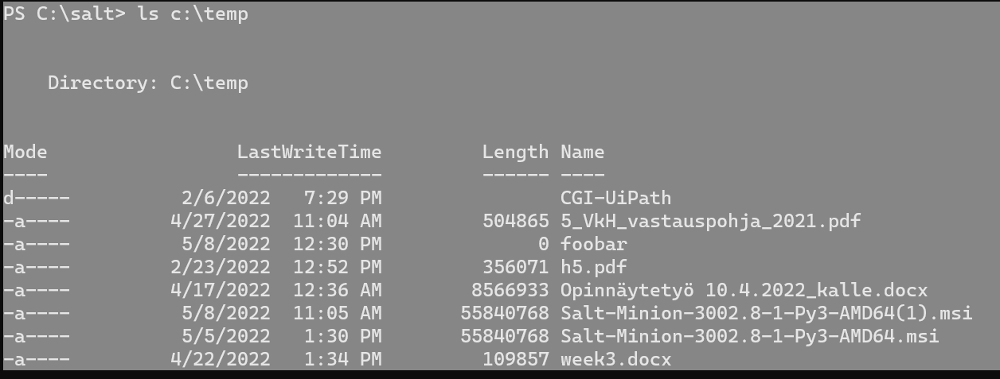

# **h6 Akkuna / Windows**

I started @ 10.30ish.
  
The source for the exercise [h6](https://terokarvinen.com/2021/configuration-management-systems-2022-spring/#h6-akkuna)
  
**Hardware & Software**  
*Win 11 + VirtualBox 6.0 + Debian 11 Bullseye*  
  
*Hardware:*  
*CPU: AMD Ryzen 9 5900HS*  
*Mem: 16 Gt LPDDR4X*  
*Storage: 512 Gt M.2 2230 NVMe PCIe 3.0 SSD*  
  
## v) Lue ja tiivistä artikkeli muutamalla ranskalaisella viivalla. Tässä z-alakohdassa ei tarvitse siis tehdä testejä tietokoneella. / Read this

[Source](https://terokarvinen.com/2018/04/18/control-windows-with-salt/)

The article is about using Salt for Windows. The basic idea is the sama as with a Linux-master to Linux-slave arrangement. Be mindfull of the versions, the master and slave should have the same version of Salt and if that's not possible, then the master's version should be newer.

This article also provides instructions on how to install a package manager for Windows and highlights that all serious computer business is done easier with Linux.

## a) Suolaikkuna. Asenna Salt Windowsiin. Jos ehdit jo asentaa, voit kirjoittaa muistinvaraisesti, mutta muista silloin merkitä, että tämä on muistista kirjoitettu. Näytä testillä (test.ping, file.managed tms), että Salt toimii. / Install Salt for Windows

I downloaded the closest version to my Linux Salt (3002.6) to my Windows (3002.8). After that I read and followed the instructions on: https://docs.saltproject.io/en/latest/topics/installation/windows.html

1. Download the installer from [Saltproject](https://repo.saltproject.io/windows/). Direct link to the version I used: https://repo.saltproject.io/windows/Salt-Minion-3002.8-1-Py3-AMD64.msi
2. Open the installer with admin rights (ie. win + x -> Windows terminal admin -> go to your download dir and run the installer)

  
*The installer looked like this*

3. I specified the master as saltmaster and let the minion be as the one the installer suggested
4. After that I tried out a version check in cmd

  
*Couldn't get Salt to work*

I was quite clueless on what I should try, so I googled. Maybe the Windows version was to fault, as I had Win 11 instead of Windows 10? So the nextr thing in line was to try it out on Win 10. For that I needed a copy, and a good place to get one was [Microsoft](https://developer.microsoft.com/en-us/microsoft-edge/tools/vms/). You need VirtualBox to use these VM's.

I downloaded the same msi-pkg for my VM. After that I pressed:

	win + x
	-> Windows PowerShell (Admin)

  
*This was how I ran Powershell with admin rights*  

After that I copied my installer to a temp directory I created and navigated there to execute it.
	
	cd ..
	cd ..
	cd temp
	.\Salt-Minion-3002.8-1-Py3-AMD64.msi

I clicked next and accepted the licence agreement until I reached the settings screen, which I left as it was.

  
*Salt settings*  

  
*Still the same error*  

The installer had created a salt-folder in the root of c. I navigated there and there I could execute *.bat-files, that are Windows script files (from my knowledge of Windows in the 90's). 

  
*Salt was working from it's directory*  

  
*It kinda worked*  

I realized that Salt worked for my Win 11 too with the same principle:

	1. Navigate to salt folder
	2. Execute *.bat files

  
*It worked for Win 11 too*  

## b) Single. Näytä komentorivillä Saltilla (state.single) esimerkit funktioista file ja cmd. / State.single with Windows

```
PS C:\salt> .\salt-call.bat --local state.single pkg.installed git
[ERROR   ] Unable to locate package git
[ERROR   ] {'git': 'Unable to locate package git'}
local:
----------
          ID: git
    Function: pkg.installed
      Result: False
     Comment: The following packages failed to install/update: git
     Started: 12:26:43.887415
    Duration: 261.875 ms
     Changes:
              ----------
              git:
                  Unable to locate package git

Summary for local
------------
Succeeded: 0 (changed=1)
Failed:    1
------------
Total states run:     1
Total run time: 261.875 ms
```

That actually executed! So next I tried out the file and cmd.
	
	.\salt-call.bat --local state.single cmd.run "echo foo"

  
*cmd.run worked in Win 11*
	
	.\salt-call.bat --local state.single file.managed c:\temp\foobar
	
That worked too, even with idempotency.

```
local:
----------
          ID: c:\temp\foobar
    Function: file.managed
      Result: True
     Comment: File c:\temp\foobar exists with proper permissions. No changes made.
     Started: 12:30:58.298605
    Duration: 25.405 ms
     Changes:

Summary for local
------------
Succeeded: 1
Failed:    0
------------
Total states run:     1
Total run time:  25.405 ms
```


*The file existed*  

# c) IaCcuna. Tee Windowsissa infraa koodina, ja aja se paikallisesti (salt-call --local state.apply foo) / Infrastructure as code in Windows

I could not find a good source on **where** should I put my Salt state, so I started with the salt directory and created a folder for it:

	cd c:\salt
	mkdir firststate
	cd firststate
	notepad init.sls

```SaltStack
c:/temp/test:
  - file.managed
```

	cd ..
	 .\salt-call.bat --local state.apply firststate
	
The error msg told me that Salt couldn't find the state:

```
local:
    Data failed to compile:
----------
    No matching sls found for 'firststate' in env 'base'
```

Next I tried giving the path as a part of the command, because why not?

	.\salt-call.bat --local state.apply c:\salt\firststate\init.sls
	.\salt-call.bat --local state.apply c:\salt\firststate\

The same error message persisted, so I decided to Google where in env 'base' actually located. The link headlines gave me an idea to look into the conf.
	
	#Open the conf in c:\salt\conf\minion
	
```SaltStack
file_roots:
  base:
    - c:/salt
```

That made the error msg change, so I had the right track.

```
local:
    Data failed to compile:
----------
    ID c:/temp/test in SLS firststate is not a dictionary
```

Took a break @ 13.29.

Returned to work @ 19.27.

The error told me that Windows would like to have a file with a file extension. So to test my thesis, I added an extension to my state.
	
	cd firststate
	notepad init.sls

```SaltStack
c:/temp/test.txt:
  - file.managed
```

After this I executeds my state again.

	cd ..
	.\salt-call.bat --local state.apply firststate

```
local:
    Data failed to compile:
----------
    ID c:/temp/test.txt in SLS firststate is not a dictionary
```

Next I tried to change the /-symbol to \.

```SaltStack
c:\temp\test.txt:
  - file.managed
```

The error persisted. Next I tried out a state with a name parameter just to be sure I knew how to make states in Windows Salt.

	mkdir
	notepad init.sls

```SaltStack
create_a_file:
  file.managed:
    - name: c:\temp\testing.txt
```

This worked, but Windows wasn't quite happy about it. The error message was a hundred lines long, but the state ran.

```
[WARNING ] State for file: c:\temp\testing.txt - Neither 'source' nor 'contents' nor 'contents_pillar' nor 'contents_grains' was defined, yet 'replace' was set to 'True'. As there is no source to replace the file with, 'replace' has been set to 'False' to avoid reading the file unnecessarily.
local:
----------
          ID: create_a_file
    Function: file.managed
        Name: c:\temp\testing.txt
      Result: True
     Comment: Empty file
     Started: 19:42:49.642628
    Duration: 28.337 ms
     Changes:
              ----------
              new:
                  file c:\temp\testing.txt created

Summary for local
------------
Succeeded: 1 (changed=1)
Failed:    0
------------
```

The second run produced the same amount of errors, but the state executed with idempotency.

```
Summary for local
------------
Succeeded: 1
Failed:    0
------------
Total states run:     1
Total run time:  25.405 ms
```

I tried to add some content by adding a parameter.

```SaltStack
create_a_file:
  file.managed:
    - name: c:\temp\testing.txt
    - content: "Foo bar"
```

I was wondering why Linux let me run an identical state with no hiccups and Windows complained. The content parameter wasn't doing anything, so I omitted it.

## e) Goal. Tee projektisi palautussivu. Voit tehdä sen GitHubiin, kotisivullesi tai mihin vain haluat. Mistä teet miniprojektin? Kuvaile miniprojektin tarkoitus lauseella tai parilla. Asenna käsin (jokin alustava osa) projektistasi ja ota ruutukaappaus siitä, miten lopputulosta käytetään. Tietysti pääset tekemään paremman ruutukaappauksen, kun projektisi on valmis. Valitse projektille lisenssi (suosittelen GPL 2, voit valita lisenssin vapaasti). Laita sivulle nimesi (tai jos haluat, nimimerkki, mutta suosittelen nimeä). Ja lähdekoodiksi vaikkapa vain Saltin hei maailma. Kirjoita ohje, miten projektisi otetaan käyttöön. Kirjoita projektin kypsyys näkyviin, tässä vaiheessa se on varmaankin alpha, eli vasta aloitettu eikä vielä voi varsinaisesti edes kunnolla testata. Yritä tehdä sivu, jossa tärkeimmät asiat näkyvät taitoksen yllä (skrollaamatta): tarkoitus, ruutukaapaus, lisenssi, nimesi, latauslinkki, kypsyysaste (alpha). Tässä vaiheessa projektin ei vielä tarvitse toimia, vaan kaikkiin osiin tehdään vielä parannuksia. Voit kirjoittaa englanniksi tai suomeksi, suosittelen englantia. / Make a page for your final project for the course

The repo for my final course assignment is:  https://github.com/kalletolonen/ConfManSystems/blob/main/h7.md

## f) Palauta linkki raporttiisi Laksuun. / Return the assignment to Laksu

The work was returned to Laksu.

## g) Anna tästä tehtävästä palaute vähintään kahdelle opiskelukaverille Laksussa. / Give feedback to peers

I will review at least 3 peer reports before the next class.


