# **h7 Oma Moduli / My own module**

**[Kalle Tolonen](https://www.linkedin.com/in/kalletolonen/)**

The source for the exercise [h7](https://terokarvinen.com/2021/configuration-management-systems-2022-spring/#h7-oma-moduli)
  
**Hardware & Software**  
*Win 11 + VirtualBox 6.0 + Debian 11 Bullseye*  
  
*Hardware:*  
*CPU: AMD Ryzen 9 5900HS*  
*Mem: 16 Gt LPDDR4X*  
*Storage: 512 Gt M.2 2230 NVMe PCIe 3.0 SSD*  

## How to make a base development and testing environment for Django idempotently

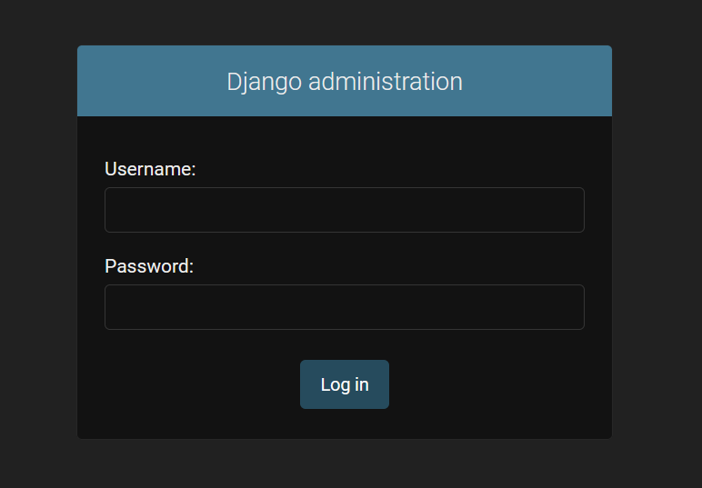  
*Django-admin console ready for logging in*

Django is a web development framework that makes it easy to get things rolling fast. The process of creating a Django dev environment is a series of manual steps that I set out to automate.

Finished state: https://github.com/kalletolonen/djangoadmin
Licence for the state: GPL 2.0

The purpose of this article is to show the process and method of creating a Salt State for a development server for Django that runs on localhost.

The current maturity state is at "hello world" in the finished repo.

Requirements for using the state:
Debian 11
Salt-minion installed

You'll be able to apply the project on your own development server by copying the contents or the finished state to **/srv/salt/djangoadmin** and then running the command:
		
	salt-state --local state.apply djangoadmin

## b) Kaikki tehtävät tähän. Listaa suora linkki kuhunkin palautukseesi h1, h2.. / List all of your homework

[h1](https://github.com/kalletolonen/ConfManSystems/blob/main/h1.md)  
[h2](https://github.com/kalletolonen/ConfManSystems/blob/main/h2.md)  
[h3](https://github.com/kalletolonen/ConfManSystems/blob/main/h3.md)  
[h4](https://github.com/kalletolonen/ConfManSystems/blob/main/h4.md)  
[h5](https://github.com/kalletolonen/ConfManSystems/blob/main/h5.md)  
[h6](https://github.com/kalletolonen/ConfManSystems/blob/main/h6.md)  

## c) Oma moduli (iso tehtävä). Ratkaise jokin oikean elämän tai keksitty tarve omilla tiloilla/moduleilla. Voit käyttää Salttia tai muuta valitsemaasi modernia keskitetyn hallinnan ohjelmaa. Esitä tulos viimeisellä opetuskerralla, 5-10 min. Live demo olisi kiva. Raportoi modulisi tarkoitus, koodi ja testit.  / Make your own Salt module

If you'd like to jump to the finished state, you can do so [here](https://github.com/kalletolonen/djangoadmin). 

I started work @ 11.30ish.

Source for the Django installation instructions: https://github.com/kalletolonen/linux_palvelimet/blob/main/tehtava6.md

Original source: https://terokarvinen.com/2022/django-instant-crm-tutorial/

First I cloned a new base VM with VirtualBox. My gameplan was to first install the Django-admin console manually and then automate the process step by step. So, to get things going I installed a bunch of programs.
	
	sudo apt-get update
	sudo apt-get install -y micro bash-completion virtualenv

After this I needed to start the create and start the  environment.

	 virtualenv --system-site-packages -p python env/
	 source env/bin/activate
	 which pip

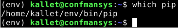  
*The environment was ready for use*  

After this I added django to requirements, installed it and checked for the version.

	echo "django" |tee requirements.txt
	pip install -r requirements.txt
	django-admin --version

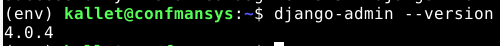  
*Django was installed*  

The next step was to start a base project for development and run the development server.

	django-admin startproject baseproject
	cd baseproject/
	./manage.py runserver

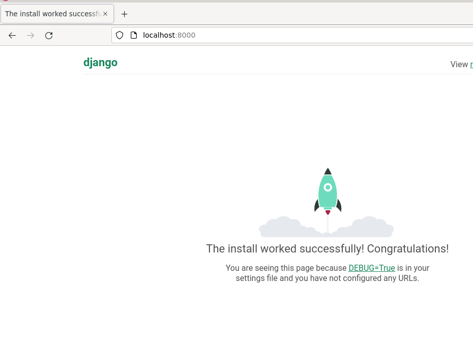  
*Django dev server was running*  

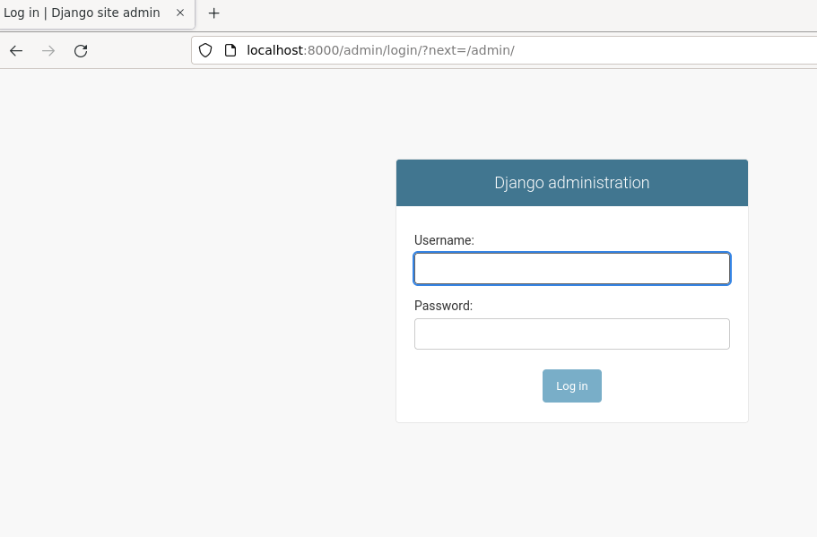  
*Admin-console was available*  

To log in the admin console I needed to create a superuser.

	./manage.py createsuperuser

This resulted in an error message, that told me I had to do something else first.

```
    return Database.Cursor.execute(self, query, params)
django.db.utils.OperationalError: no such table: auth_user
```

So I made database migrations for the project.

	./manage.py makemigrations
	./manage.py migrate
	./manage.py createsuperuser

I added a djangoadmin user and managed to log into the account.

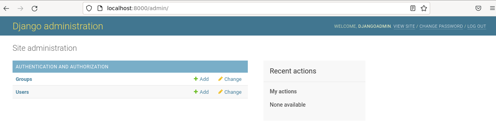  
*Login was successfull*  

I took a break @ 12.47, since this was the initial scope of my project done manually.

Returned to work @ 13.05.

### Installing Salt minion

I didn't need salt-master for this project by default, but I installed it anyway on the same go. I opened a fesh terminal in my home direcotory and entered a command.

	sudo apt-get install -y salt-master salt-minion
	salt --version

```
kallet@confmansys:~$ salt --version
salt 3002.6
```

### Installing Virtualenv with salt

First I created a folder for my project and a helloworld for Salt in it.

	sudo mkdir -p /srv/salt/djangoadmin
	sudoedit /srv/salt/djangoadmin/init.sls


```SaltStack
/tmp/test:
  file.managed
```

**Test**
	
	sudo salt-call --local state.apply djangoadmin
	
```
After 2 times execution

     Comment: File /tmp/test exists with proper permissions. No changes made.
     Started: 13:19:25.440783
    Duration: 5.168 ms
     Changes:   

Summary for local
------------
Succeeded: 1
Failed:    0
------------
Total states run:     1
Total run time:   5.168 ms
```

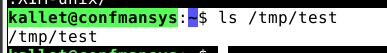  
*Hello world was working*  

After this I modified my state to install Virtualenv.
	
	sudoedit /srv/salt/djangoadmin/init.sls
	
	
```SaltStack
virtualenv:
  pkg.installed
```

To test this, I uninstalled virtualenv (Django was inside it, so no need to uninstall it).

	#In my home directory
	rm -r env
	sudo apt-get purge virtualenv -y

I didn't have any luck with removing the Virtualenv.

```
kallet@confmansys:~$ virtualenv --version
virtualenv 20.4.0+ds from /usr/lib/python3/dist-packages/virtualenv/__init__.py
```

So I removed the folder that --version was referring to to atleast cripple it. I couldn't find a source on how to actually remove it.
	
	sudo rm -r /usr/lib/python3/dist-packages/virtualenv

```
kallet@confmansys:~$ virtualenv --version
Traceback (most recent call last):
  File "/usr/bin/virtualenv", line 33, in <module>
    sys.exit(load_entry_point('virtualenv==20.4.0+ds', 'console_scripts', 'virtualenv')())
  File "/usr/bin/virtualenv", line 25, in importlib_load_entry_point
    return next(matches).load()
  File "/usr/lib/python3.9/importlib/metadata.py", line 77, in load
    module = import_module(match.group('module'))
  File "/usr/lib/python3.9/importlib/__init__.py", line 127, in import_module
    return _bootstrap._gcd_import(name[level:], package, level)
  File "<frozen importlib._bootstrap>", line 1030, in _gcd_import
  File "<frozen importlib._bootstrap>", line 1007, in _find_and_load
  File "<frozen importlib._bootstrap>", line 972, in _find_and_load_unlocked
  File "<frozen importlib._bootstrap>", line 228, in _call_with_frames_removed
  File "<frozen importlib._bootstrap>", line 1030, in _gcd_import
  File "<frozen importlib._bootstrap>", line 1007, in _find_and_load
  File "<frozen importlib._bootstrap>", line 984, in _find_and_load_unlocked
ModuleNotFoundError: No module named 'virtualenv'

```

Now I didn't have Virtualenv, so I could test out my state.

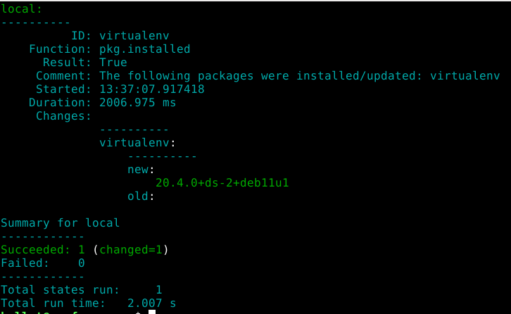  
*Salt installed the pkg*  

Running the state a second time confirmed idempotency.

	sudo salt-call --local state.apply djangoadmin
	

```
Summary for local
------------
Succeeded: 1
Failed:    0
------------
Total states run:     1
Total run time:  48.364 ms
```

Now I had an issue with Virtualenv, since it didn't work anymore.

```
ModuleNotFoundError: No module named 'virtualenv'
```

Virtualenv is an [isolated copy of Python](https://www.pythonforbeginners.com/basics/how-to-use-python-virtualenv), so deleting some directories propably damaged the system quite bad.

So the next thing was to install python3 again to fix this issue. I uninstalled python3 and added it to my state.

	sudo apt-get purge -y python3

Python 3 was still installed and happy, so I tried to delete some more. It's confusing that removing a program is such a ridiculous thing - why would you need to remove everything named python3(something) to remove it?
	
	sudo apt-get purge -y  python3*

```
kallet@confmansys:~$ python3
bash: /usr/bin/python3: No such file or directory
```
	
	sudoedit /srv/salt/djangoadmin/init.sls
	

```SaltStack
virtualenv:
  pkg.installed

python3:
  pkg.installed
```

	sudo salt-call --local state.apply djangoadmin

This resulted in an error with Salt, since salt uses Python.

```
sudo: salt-call: command not found
```

So I installed python3 and salt manually and tried again.
	
	sudo apt-get install -y python3 salt-master salt-minion
	sudo salt-call --local state.apply djangoadmin

```
After 2 runs 

Summary for local
------------
Succeeded: 2
Failed:    0
------------
Total states run:     2
Total run time:  55.668 ms
```

I took a break @ 13.56.

Returned to work @ 18.23.
	
### Setting system site pkg's with Virtualenv and creating the project

I decided to try out making the command to set up system site packages (that allows the environment to use the Python pkg's in /lib/site-packages) by checking that a folder had been created and it has the same pkg's as the operating system. My VM did not start up anymore, so removing and installing Python with my earlier method might not be a great idea. I made a new VM clone and started over.

	sudo apt-get update
	sudo apt-get install -y salt-master salt-minion bash-completion micro
	export EDITOR=micro
	sudo mkdir -p /srv/salt/djangoadmin
	sudoedit /srv/salt/djangoadmin/init.sls


```SaltStack
virtualenv:
  pkg.installed
```
	
	sudo salt-call --local state.apply djangoadmin

```
#After 2nd run

Summary for local
------------
Succeeded: 1
Failed:    0
------------
Total states run:     1
Total run time:  49.776 ms
```

The state worked, so next it was time to create the environment with system site pkg's.
	
	sudoedit /srv/salt/djangoadmin/init.sls

```SaltStack
virtualenv:
  pkg.installed

virtualenv --system-site-packages -p python3 env/:
  cmd.run
```

	sudo salt-call --local state.apply djangoadmin

That did create the environment, but the state wasn't idempotent.

```
#After 2nd run

Summary for local
------------
Succeeded: 2 (changed=1)
Failed:    0
------------
Total states run:     2
Total run time: 202.991 ms
```

ls did actually prove, that it did not work at all, eventhough the stdout suggested it did.
	
	ls

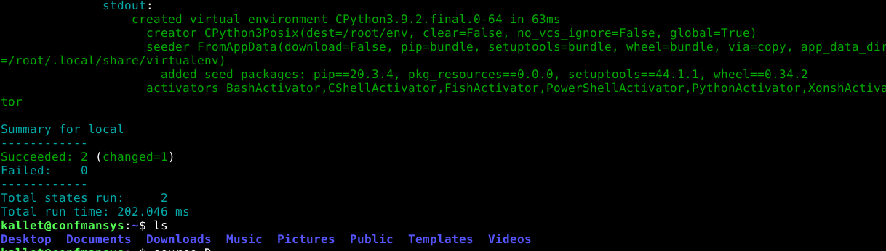  
*The outcome wasn't as expected*  

To debug this, I changed the targer folder in the state and checked the status with ls.

	sudoedit /srv/salt/djangoadmin/init.sls

```SaltStack
virtualenv:
  pkg.installed

virtualenv --system-site-packages -p python3 env1/:
  cmd.run
```
	
	sudo salt-call --local state.apply djangoadmin
	ls

That had the same outcome as earlier. So then I tried it out just on the CLI. The CLI command worked like a charm, so then I tried to modify the state to see if I knew how to make cmd.run states.

```SaltStack
#init.sls

virtualenv:
  pkg.installed

echo "foo":
  cmd.run
```

That worked.

```
Summary for local
------------
Succeeded: 2 (changed=1)
Failed:    0
------------
Total states run:     2
Total run time:  65.611 ms
```

My situation was that I knew how to make cmd.run states, but the outcome wasn't as expected, eventhough the stdout suggested it was. So, next I tried to create a directory with a CLI-command as cmd.run.

```SaltStack
virtualenv:
  pkg.installed

mkdir foo:
  cmd.run
```

The stdout suggested that the command ran, but ls proved that the outcome wasn't a directory. Next step was Googling with "Why doesn't cmd.run allow mkdir in salt state". That didn't yield much, but I realized that Salt had probably been creating the folders in somewhere else, ie. the Salt directory. I checked that, but no luck. I decided to check the whole system and searched for [a command](https://www.cyberciti.biz/faq/howto-find-a-directory-linux-command/) to do so.

	cd /
	sudo find / -type d -name "env1" |grep lib

That didn't help. I executed my state again and now the error msg was helpfull.

```
----------
          ID: mkdir foo
    Function: cmd.run
      Result: False
     Comment: Command "mkdir foo" run
     Started: 19:10:53.195338
    Duration: 5.571 ms
     Changes:   
              ----------
              pid:
                  26062
              retcode:
                  1
              stderr:
                  mkdir: cannot create directory 'foo': File exists
              stdout:

Summary for local
------------
Succeeded: 1 (changed=1)
Failed:    1
```

I had created the folder under root.

```
kallet@confmansys:/$ sudo find / -type d -name "foo"
/root/foo
find: ‘/run/user/1000/doc’: Permission denied
```

I googled "how to create a directory in the current user's home directory" and got [a good hint](https://serverfault.com/questions/915600/saltstack-how-to-create-user-and-a-directory-in-his-home-directory) on how I should mod my state.

```SaltStack
virtualenv:
  pkg.installed

currentuser:
  user.present

make_env_directory:
  file.directory:
    - name: ~currentuser/foo
```

That created a /home/currentuser/foo directory. I clearly needed some programming to get things done and I remembered Jinja: https://terokarvinen.com/2018/04/10/make-a-million-of-those-jinja-templating-salt-states/?fromSearch=salt

Somehow that rabbit hole and googling about Jinja led me to find out that Virtualenv has [a dedicated function](https://docs.saltproject.io/en/latest/ref/states/all/salt.states.virtualenv_mod.html) in Salt.

The source suggested creating the env in /var/www/ which is a location I could live with.

```SaltStack
#init.sls

virtualenv:
  pkg.installed

/var/www/env:
  virtualenv.managed:
    - system_site_packages: True 
```

That seemed to work.

```
#After 2nd run

----------
          ID: /var/www/env
    Function: virtualenv.managed
      Result: True
     Comment: virtualenv exists
     Started: 20:06:20.206772
    Duration: 0.884 ms
     Changes:   

Summary for local
------------
Succeeded: 2
Failed:    0
------------
Total states run:     2
Total run time:  49.150 ms
```

To be sure, I checked my location for the env.

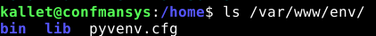  
*env-folder existed with lib*  

### Installing Django in Virtualenv

The documentation hinted at the fact that I could have a requirements.txt in my salt-server's file location, so I added those lines to my state and a requirements.txt to /srv/salt/djangoadmin/

	sudoedit /srv/salt/djangoadmin/requirements.txt
	#wrote django and saved
	sudoedit /srv/salt/djangoadmin/init.sls

```SaltStack
virtualenv:
  pkg.installed

/var/www/env:
  virtualenv.managed:
    - system_site_packages: True
    - requirements: salt://djangoadmin/requirements.txt
```

That worked!

```
#After 2nd run

----------
          ID: /var/www/env
    Function: virtualenv.managed
      Result: True
     Comment: virtualenv exists
     Started: 20:18:26.759762
    Duration: 3776.694 ms
     Changes:   

Summary for local
------------
Succeeded: 2
Failed:    0
------------
Total states run:     2
Total run time:   3.824 s
```

I wanted to see if I could activate the environment and run server manually at this point, so I did just that.

	source /var/www/env/bin/activate

```
(env) kallet@confmansys:/$ django-admin --version
4.0.4
(env) kallet@confmansys:/$ deactivate
kallet@confmansys:/$ django-admin --version
bash: django-admin: command not found
```

I realized that I was having the the same problem again - where should my state create a project (so that it wouldn't require an absolute path with my user name)? While googling this I noticed, that Salt had a [dedicated Django module](https://docs.saltproject.io/en/latest/ref/modules/all/salt.modules.djangomod.html) as well, so that might be usefull down the line. 

Another [source](https://www.barrymorrison.com/2013/Mar/11/deploying-django-with-salt-stack/) had done a similar project in 2013.

Next I decided to create a dedicated django user and try running the env as the user.

```
#init.sls

djangouser:
  user.present:
    - fullname: Django User
    - home: /home/djangouser

virtualenv:
  pkg.installed

/home/djangouser/env:
  virtualenv.managed:
    - system_site_packages: True
    - requirements: salt://djangoadmin/requirements.txt
```

That worked, but the user didn't have a strong password. I decided to look into it if I would have enough time in the end.

```
#After 2nd run

Summary for local
------------
Succeeded: 3
Failed:    0
------------
Total states run:     3
Total run time:   3.824 s
```

So, now I had a home directory with an environment.

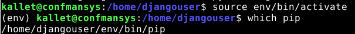  
*env-folder existed and pip was in the right place*  

I added a version parameter to my requirements.txt.

```
django==4.0.4
```

This addition made sure that I had the correct version of Django (one that I knew would work).

### Starting a Django project in Virtualenv

I didn't have a clue on how to do this. So I did what was reasonable, I searched with a dozen terms and still had nothing. Sources I used:
https://www.barrymorrison.com/2013/Mar/11/deploying-django-with-salt-stack/  
https://docs.saltproject.io/en/latest/ref/modules/all/salt.modules.djangomod.html  
https://docs.saltproject.io/en/latest/ref/states/all/salt.states.virtualenv_mod.html  

My new init.sls. I obviously had many issues.

```SaltStack
#init.sls

djangouser:
  user.present:
    - fullname: Django User
    - home: /home/djangouser

virtualenv:
  pkg.installed

/home/djangouser/env:
  virtualenv.managed:
    - system_site_packages: True
    - requirements: salt://djangoadmin/requirements.txt

/home/djangouser/baseproject:
  file.directory:
    - user: djangouser

create Django project:
    cmd.run:
        - user: djangouser
        - name: source /home/djangouser/env/bin/activate && django-admin.py startproject baseproject
        - cwd: /home/djangouser/baseproject/

```

That did not work.

```
----------
          ID: create Django project
    Function: cmd.run
        Name: source /home/djangouser/env/bin/activate && django-admin.py startproject baseproject
      Result: False
     Comment: Command "source /home/djangouser/env/bin/activate && django-admin.py startproject baseproject" run
     Started: 22:12:56.660411
    Duration: 7.267 ms
     Changes:   
              ----------
              pid:
                  28943
              retcode:
                  127
              stderr:
                  /bin/bash: line 1: django-admin.py: command not found
              stdout:

Summary for local
------------
Succeeded: 4 (changed=2)
Failed:    1
```

The error told me that the Virtual Environment wasn't propably working. The state produced Django errors too, so I wasn't completely off.

```
[ERROR   ] Command 'source' failed with return code: 127
[ERROR   ] stderr: /bin/bash: line 1: django-admin.py: command not found
```

So after a lot of trial and error I had a non-idempotent state that successfully checked the Django version (ie. executed inside an environment.

```SaltStack
#init.sls

djangouser:
  user.present:
    - fullname: Django User
    - home: /home/djangouser

virtualenv:
  pkg.installed

/home/djangouser/env:
  virtualenv.managed:
    - system_site_packages: True
    - requirements: salt://djangoadmin/requirements.txt

/home/djangouser/baseproject:
  file.directory:
    - user: djangouser

create Django project:
    cmd.run:
        - user: djangouser
        - name: "source /home/djangouser/env/bin/activate && django-admin --version"
        - cwd: /home/djangouser/env/
        - require:
          - virtualenv: /home/djangouser/env
```

This was a good spot to call it a night. I quit @ 22.53.

Back to work the next day @ 11.56.

```SaltStack
#init.sls

djangouser:
  user.present:
    - fullname: Django User
    - home: /home/djangouser

virtualenv:
  pkg.installed

/home/djangouser/env:
  virtualenv.managed:
    - system_site_packages: True
    - requirements: salt://djangoadmin/requirements.txt

/home/djangouser/baseproject:
  file.directory:
    - user: djangouser

create Django project:
    cmd.run:
        - user: djangouser
        - name: "source /home/djangouser/env/bin/activate && django-admin startproject baseproject"
        - cwd: /home/djangouser/baseproject
        - require:
          - virtualenv: /home/djangouser/env
```

My modded state created the project, but not idempotently, as it was just a simple cmd.run.

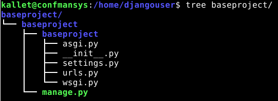  
*Created a project with Salt*  

The state did create a project, but failed (obviously) on the 2nd run.

```
#2nd run

----------
          ID: create Django project
    Function: cmd.run
        Name: source /home/djangouser/env/bin/activate && django-admin startproject baseproject
      Result: False
     Comment: Command "source /home/djangouser/env/bin/activate && django-admin startproject baseproject" run
     Started: 12:02:45.146550
    Duration: 108.929 ms
     Changes:   
              ----------
              pid:
                  30725
              retcode:
                  1
              stderr:
                  CommandError: '/home/djangouser/baseproject/baseproject' already exists
              stdout:

Summary for local
------------
Succeeded: 4 (changed=1)
Failed:    1
------------
Total states run:     5
Total run time:   3.991 s
```

I decided that a good wasy to make this idempotent was to simply check for the folder's existance. I also noticed that I had the project structure a bit wonky, as I had 3 baseproject-folders.

	sudo rm -r baseproject

```SaltStack
#init.sls

djangouser:
  user.present:
    - fullname: Django User
    - home: /home/djangouser

virtualenv:
  pkg.installed

/home/djangouser/env:
  virtualenv.managed:
    - system_site_packages: True
    - requirements: salt://djangoadmin/requirements.txt

#/home/djangouser/baseproject:
#  file.directory:
#    - user: djangouser

create Django project:
    cmd.run:
        - user: djangouser
        - name: "source /home/djangouser/env/bin/activate && django-admin startproject baseproject"
        - cwd: /home/djangouser/
        - require:
          - virtualenv: /home/djangouser/env
```

I tried my new state out. This time it worked like a charm! I also noticed a bug in Micro. When you have 2 terminal windows open and save your existing file, it doesn't actually save the file. I executed my state from another terminal and it executed the old state, eventhought I had saved it on the other terminal in Micro (and left the editor open).

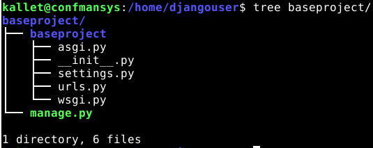  
*Tree showed that now I had a proper directory structure*  

Next I tried to make the command idempotent. I did a ton of trial and error, which I will not document in great detail. [A source](https://bencane.com/2013/09/23/remote-command-execution-with-saltstack/) that made me understand how to use the unless-parameter was helpfull. I also needed help with the [test command](https://www.cyberciti.biz/tips/find-out-if-file-exists-with-conditional-expressions.html). I made my state a bit leaner, since half of my state wasn't doing anything - I figured this out by commenting all the lines out individually until something made a difference.

```SaltStack
#init.sls

djangouser:
  user.present:
    - fullname: Django User
    - home: /home/djangouser

virtualenv:
  pkg.installed

/home/djangouser/env:
  virtualenv.managed:
    - system_site_packages: True
    - requirements: salt://djangoadmin/requirements.txt

source /home/djangouser/env/bin/activate && django-admin startproject baseproject:
  cmd.run:
    - unless: test -d /home/djangouser/baseproject
    - cwd: /home/djangouser/
```

So now I had an idempotent state that would create a Django project named "baseproject". I took a break @ 13.50.

Back to business @ 16.37.

### Starting the development server

I started my experimenting by adding 1 more cmd.run to my state.

```SaltStack
#init.sls

djangouser:
  user.present:
    - fullname: Django User
    - home: /home/djangouser

virtualenv:
  pkg.installed

/home/djangouser/env:
  virtualenv.managed:
    - system_site_packages: True
    - requirements: salt://djangoadmin/requirements.txt

source /home/djangouser/env/bin/activate && django-admin startproject baseproject:
  cmd.run:
    - unless: test -d /home/djangouser/baseproject
    - cwd: /home/djangouser/

./manage.py runserver:
  cmd.run:
    - cwd: /home/djangouser/baseproject/

```

A simple cmd.run didn't do the trick.

```
----------
          ID: ./manage.py runserver
    Function: cmd.run
      Result: False
     Comment: Command "./manage.py runserver" run
     Started: 16:42:28.253638
    Duration: 17.381 ms
     Changes:   
              ----------
              pid:
                  36060
              retcode:
                  127
              stderr:
                  /usr/bin/env: 'python': No such file or directory
              stdout:

Summary for local
------------
Succeeded: 4 (changed=1)
Failed:    1
```

I realized that the earlier env-activation would have been ended before the next command, so I just added that to a new command.

```SaltStack
djangouser:
  user.present:
    - fullname: Django User
    - home: /home/djangouser

virtualenv:
  pkg.installed

/home/djangouser/env:
  virtualenv.managed:
    - system_site_packages: True
    - requirements: salt://djangoadmin/requirements.txt

source /home/djangouser/env/bin/activate && django-admin startproject baseproject:
  cmd.run:
    - unless: test -d /home/djangouser/baseproject
    - cwd: /home/djangouser/

source /home/djangouser/env/bin/activate && ./manage.py runserver:
  cmd.run:
    - cwd: /home/djangouser/baseproject/

```
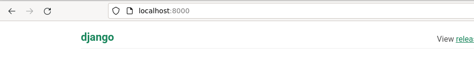  
*Django was running @ localhost*  

On a second thought, this wasn't actually helpfull, since I didn't have the debug-tools of the development server at my use (Salt was just executing endlessly (ie. running the server)). On this note I omitted this command from my state and opted to do the migrations instead.

### Making migrations in the Django project

I made the migration idempotent in a queer way, by examing the output of the command. In other words, the migrations are made no matter what, but only reported if there was something to actually migrate.

```SaltStack
djangouser:
  user.present:
    - fullname: Django User
    - home: /home/djangouser

virtualenv:
  pkg.installed

/home/djangouser/env:
  virtualenv.managed:
    - system_site_packages: True
    - requirements: salt://djangoadmin/requirements.txt

source /home/djangouser/env/bin/activate && django-admin startproject baseproject:
  cmd.run:
    - unless: test -d /home/djangouser/baseproject
    - cwd: /home/djangouser/

source /home/djangouser/env/bin/activate && ./manage.py migrate && ./manage.py makemigrations:
  cmd.run:
    - unless: source /home/djangouser/env/bin/activate && ./manage.py migrate | grep "No migrations to apply"
    - cwd: /home/djangouser/baseproject/
```

After running the state 2 times I had an idempotent state with migrations.

```
#After 2nd run

Summary for local
------------
Succeeded: 5
Failed:    0
------------
Total states run:     5
Total run time:   4.597 s
```

To check out my results on a concrete manner, I navigated to my project and started the dev server.

	cd /home/djangouser
	source env/bin/activate
	cd baseproject
	./manage.py runserver

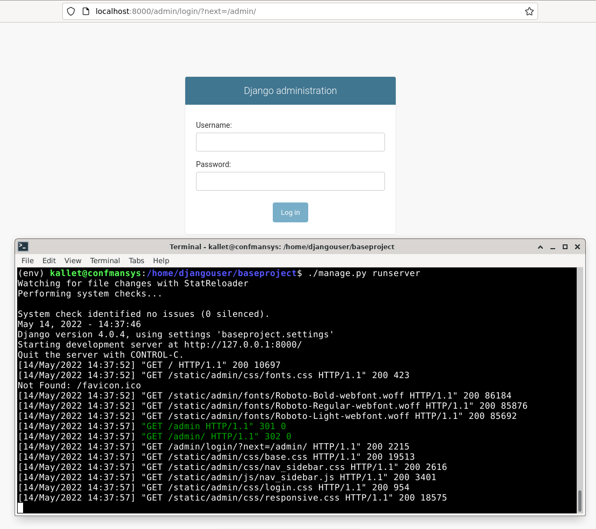  
*Django had the admin console*  

### Creating a superuser for the project
	
	


	

### Automating the superuser creation

Django does have a CLI-command to create a superuser without user input, so I decided to try it out. My main problem was that ./manage.py was producing not producing stdout. It was printing stderr instead and, to my knowledge, you can't use grep on that. Django does not allow setting a superuser from CLI with a password without human input(0), so I googled for a workaround (1,2).

Source 0: https://vuyisile.com/how-to-automate-creating-a-django-super-user/
Source 1: https://code.djangoproject.com/ticket/27769
Source 2: https://unix.stackexchange.com/questions/117467/how-to-permanently-set-environmental-variables

I added a line to my bash.bashrc.

	sudo micro /etc/bash.bashrc

```
export DJANGO_SUPERUSER_PASSWORD=testpass1234
```

After that I deleted the Django project and ran my state again. To my amazement, the username persisted.

```
---------
          ID: source /home/djangouser/env/bin/activate && ./manage.py createsuperuser --noinput --username djangouser --email test@best.com
    Function: cmd.run
      Result: False
     Comment: Command "source /home/djangouser/env/bin/activate && ./manage.py createsuperuser --noinput --username djangouser --email test@best.com" run
     Started: 18:47:09.600623
    Duration: 494.704 ms
     Changes:   
              ----------
              pid:
                  39869
              retcode:
                  1
              stderr:
                  CommandError: Error: That username is already taken.
              stdout:

Summary for local
------------
Succeeded: 5 (changed=1)
Failed:    1
------------
Total states run:     6
Total run time:   5.116 s
```

I decided to try out manual user creation and see if that would produce same results.
	
	cd /home/djangouser/
	source env/bin/activate
	cd baseproject/
	./manage.py createsuperuser

That resulted in an unexpected error.

```
django.db.utils.OperationalError: attempt to write a readonly database
```
	
Salt had ran as root and thus everything had only writing access for root.

```
(env) kallet@confmansys:/home/djangouser/baseproject$ ls -l
total 136
drwxr-xr-x 3 root root   4096 14. 5. 18:43 baseproject
-rw-r--r-- 1 root root 131072 14. 5. 18:43 db.sqlite3
-rwxr-xr-x 1 root root    667 14. 5. 18:43 manage.py
```

I took a break @ 18.52.

Returned to work @ 19.44.

I decided that I would not add a superuser automatically, as that would be a security risk, as it would mean using a standard password for the said superuser. The user rights would need to be addressed. 

I referred to [this post](https://stackoverflow.com/questions/42509578/saltstack-change-file-permissions) as a source for how to do that.

```SaltStack
djangouser:
  user.present:
    - fullname: Django User
    - home: /home/djangouser

virtualenv:
  pkg.installed

/home/djangouser/env:
  virtualenv.managed:
    - system_site_packages: True
    - requirements: salt://djangoadmin/requirements.txt

source /home/djangouser/env/bin/activate && django-admin startproject baseproject:
  cmd.run:
    - unless: test -d /home/djangouser/baseproject
    - cwd: /home/djangouser/

source /home/djangouser/env/bin/activate && ./manage.py migrate && ./manage.py makemigrations:
  cmd.run:
    - unless: source /home/djangouser/env/bin/activate && ./manage.py migrate | grep "No migrations to apply"
    - cwd: /home/djangouser/baseproject/

/home/djangouser:
  file.directory:
    - user: djangouser
    - group: djangouser
    - dir_mode: 755
    - file_mode: 755
    - follow_symlinks: True
    - recurse:
      - user
      - group
      - mode
```

I tested it out and had similar results, ie. still the wrong user. I was running the environment as kallet, my user, so that would explain that. I had to take time off to think about this and what I should do, so I quit @ 20.22.
		
Started again the next day @ 13.30. 

I concluded that there was no way for me to know what user the user of this Salt state would like to use, so I it easy to customize with a Jinja variable.

```SaltStack
init.sls

 #The name of the user you're going to be operating the dev server as.

virtualenv:
  pkg.installed

/home/{{ name }}/env:
  virtualenv.managed:
    - system_site_packages: True
    - requirements: salt://djangoadmin/requirements.txt

source /home/{{ name }}/env/bin/activate && django-admin startproject baseproject:
  cmd.run:
    - unless: test -d /home/{{ name }}/baseproject
    - cwd: /home/{{ name }}/

source /home/{{ name }}/env/bin/activate && ./manage.py migrate && ./manage.py makemigrations:
  cmd.run:
    - unless: source /home/{{ name }}/env/bin/activate && ./manage.py migrate | grep "No migrations to apply"
    - cwd: /home/{{ name }}/baseproject/

/home/{{ name }}:
  file.directory:
    - user: {{ name }}
    - group: {{ name }}
    - dir_mode: 755
    - file_mode: 755
    - follow_symlinks: True
    - recurse:
      - user
      - group
      - mode
```

The last thing I thought about, was making the setup just a tad more secure, so I decided to add a custom settings.py for the project and allow access only from localhost, so that my state wouldn't be implemented to production without atleast modifying that file manually.
	
	micro /home/kallet/baseproject/baseproject/settings.py
	
```
#settings.py

ALLOWED_HOSTS = ['localhost']
```

	sudo cp /home/kallet/baseproject/baseproject/settings.py /srv/salt/djangoadmin/
	sudoedit /srv/salt/djangoadmin/init.sls

```SaltStack
 #The name of the user you're going to be operating the dev server as.

virtualenv:
  pkg.installed

/home/{{ name }}/env:
  virtualenv.managed:
    - system_site_packages: True
    - requirements: salt://djangoadmin/requirements.txt

source /home/{{ name }}/env/bin/activate && django-admin startproject baseproject:
  cmd.run:
    - unless: test -d /home/{{ name }}/baseproject
    - cwd: /home/{{ name }}/

/home/{{ name }}/baseproject/baseproject/settings.py:
  file.managed:
    - source: salt://djangoadmin/settings.py

source /home/{{ name }}/env/bin/activate && ./manage.py migrate && ./manage.py makemigrations:
  cmd.run:
    - unless: source /home/{{ name }}/env/bin/activate && ./manage.py migrate | grep "No migrations to apply"
    - cwd: /home/{{ name }}/baseproject/

/home/{{ name }}:
  file.directory:
    - user: {{ name }}
    - group: {{ name }}
    - dir_mode: 755
    - file_mode: 755
    - follow_symlinks: True
    - recurse:
      - user
      - group
      - mode
```

Also, every project would need an app anyway, so I decided to add that to kick off the development. I used a [familiar source](https://terokarvinen.com/2022/django-instant-crm-tutorial/?fromSearch=django) for this. I also made my localhost change with a similar solution and deleted the above method from my state.

```SaltStack
 #The name of the user you're going to be operating the dev server as.
 #The name off your project
 #The name off your app in your project

virtualenv:
  pkg.installed

/home/{{ name }}/env:
  virtualenv.managed:
    - system_site_packages: True
    - requirements: salt://djangoadmin/requirements.txt

source /home/{{ name }}/env/bin/activate && django-admin startproject {{ project }}:
  cmd.run:
    - unless: test -d /home/{{ name }}/baseproject
    - cwd: /home/{{ name }}/

/home/{{ name }}/{{ project }}/{{ project }}/settings.py:
  file.blockreplace:
    - marker_start: "    'django.contrib.staticfiles',"
    - marker_end: "]"
    - content: "    '{{ app }}'"
    - marker_start: "DEBUG = True"
    - marker_end: "# Application definition"
    - content: "ALLOWED_HOSTS = ['localhost']"
    - append_if_not_found: True

source /home/{{ name }}/env/bin/activate && ./manage.py migrate && ./manage.py makemigrations:
  cmd.run:
    - unless: source /home/{{ name }}/env/bin/activate && ./manage.py migrate | grep "No migrations to apply"
    - cwd: /home/{{ name }}/{{ project }}/

/home/{{ name }}/{{ project }}:
  file.directory:
    - user: {{ name }}
    - group: {{ name }}
    - dir_mode: 755
    - file_mode: 755
    - follow_symlinks: True
    - recurse:
      - user
      - group
      - mode
```

This was my finished state. The things a developer would have to do to start a project would be:

1. install salt-minion
2. mkdir /srv/salt/
3. clone this state's repo to /srv/salt
4. sudoedit 3 variables in init.sls
5. run the state
6. create a superuser
7. start development

Things I have chosen to NOT INCLUDE:
- A default model (since I have no clue what user's would be developing)
- Registering the said model to admin.py for the same reason
- Automatically starting the dev-server with Salt, since that solution would have no Django dev tools at the user's disposal

Finished state in a separate repo:
https://github.com/kalletolonen/djangoadmin

### Testing

To test my instructions & my state, I made an empty VM with just Debian 11 & Guest Additions installed. The tests proved that I had messed up the settings.py, since it was not available and I didn't have requirements.txt ready either.

```
local:
----------
          ID: virtualenv
    Function: pkg.installed
      Result: True
     Comment: The following packages were installed/updated: virtualenv
     Started: 15:49:46.907590
    Duration: 8426.097 ms
     Changes:   
              ----------
              libexpat1-dev:
                  ----------
                  new:
                      2.2.10-2+deb11u3
                  old:
              libpython3-dev:
                  ----------
                  new:
                      3.9.2-3
                  old:
              libpython3.9-dev:
                  ----------
                  new:
                      3.9.2-1
                  old:
              python-pip-whl:
                  ----------
                  new:
                      20.3.4-4+deb11u1
                  old:
              python3-appdirs:
                  ----------
                  new:
                      1.4.4-1
                  old:
              python3-dev:
                  ----------
                  new:
                      3.9.2-3
                  old:
              python3-distlib:
                  ----------
                  new:
                      0.3.2+really+0.3.1-0.1
                  old:
              python3-distutils:
                  ----------
                  new:
                      3.9.2-1
                  old:
              python3-filelock:
                  ----------
                  new:
                      3.0.12-2
                  old:
              python3-importlib-metadata:
                  ----------
                  new:
                      1.6.0-2
                  old:
              python3-lib2to3:
                  ----------
                  new:
                      3.9.2-1
                  old:
              python3-more-itertools:
                  ----------
                  new:
                      4.2.0-3
                  old:
              python3-pip:
                  ----------
                  new:
                      20.3.4-4+deb11u1
                  old:
              python3-setuptools:
                  ----------
                  new:
                      52.0.0-4
                  old:
              python3-virtualenv:
                  ----------
                  new:
                      20.4.0+ds-2+deb11u1
                  old:
              python3-wheel:
                  ----------
                  new:
                      0.34.2-1
                  old:
              python3-zipp:
                  ----------
                  new:
                      1.0.0-3
                  old:
              python3.9-dev:
                  ----------
                  new:
                      3.9.2-1
                  old:
              virtualenv:
                  ----------
                  new:
                      20.4.0+ds-2+deb11u1
                  old:
              zlib1g-dev:
                  ----------
                  new:
                      1:1.2.11.dfsg-2+deb11u1
                  old:
----------
          ID: /home/kallet/env
    Function: virtualenv.managed
      Result: False
     Comment: pip requirements file 'salt://djangoadmin/requirements.txt' not found
     Started: 15:49:55.336080
    Duration: 18.342 ms
     Changes:   
----------
          ID: source /home/kallet/env/bin/activate && django-admin startproject baseproject
    Function: cmd.run
      Result: False
     Comment: Command "source /home/kallet/env/bin/activate && django-admin startproject baseproject" run
     Started: 15:49:55.355037
    Duration: 1014.443 ms
     Changes:   
              ----------
              pid:
                  4591
              retcode:
                  1
              stderr:
                  /bin/bash: line 1: /home/kallet/env/bin/activate: No such file or directory
              stdout:
----------
          ID: /home/kallet/baseproject/baseproject/settings.py
    Function: file.blockreplace
      Result: False
     Comment: /home/kallet/baseproject/baseproject/settings.py: file not found
     Started: 15:49:56.369640
    Duration: 0.956 ms
     Changes:   
----------
          ID: source /home/kallet/env/bin/activate && ./manage.py migrate && ./manage.py makemigrations
    Function: cmd.run
      Result: True
     Comment: unless condition is true
     Started: 15:49:56.370691
    Duration: 6.37 ms
     Changes:   
----------
          ID: /home/kallet/baseproject
    Function: file.directory
      Result: True
     Comment: Directory /home/kallet/baseproject updated
     Started: 15:49:56.377188
    Duration: 3.101 ms
     Changes:   
              ----------
              /home/kallet/baseproject:
                  New Dir

Summary for local
------------
Succeeded: 3 (changed=3)
Failed:    3
------------
Total states run:     6
Total run time:   9.469 s
```

I had some errors, which were a result of trying to do something with a file that hadn't yet been created. My updated final state was as follows:

```SaltStack
 #The name of the user you're going to be operating the dev server as.
 #The name off your project
 #The name off your app in your project

virtualenv:
  pkg.installed

/home/{{ name }}/env:
  virtualenv.managed:
    - system_site_packages: True
    - requirements: salt://djangoadmin/requirements.txt

source /home/{{ name }}/env/bin/activate && django-admin startproject {{ project }}:
  cmd.run:
    - unless: test -d /home/{{ name }}/baseproject
    - cwd: /home/{{ name }}/

source /home/{{ name }}/env/bin/activate && ./manage.py migrate && ./manage.py makemigrations:
  cmd.run:
    - unless: source /home/{{ name }}/env/bin/activate && ./manage.py migrate | grep "No migrations to apply"
    - cwd: /home/{{ name }}/{{ project }}/

/home/{{ name }}/{{ project }}/{{ project }}/settings.py:
  file.blockreplace:
    - marker_start: "    'django.contrib.staticfiles',"
    - marker_end: "]"
    - content: "    '{{ app }}'"
    - marker_start: "DEBUG = True"
    - marker_end: "# Application definition"
    - content: "ALLOWED_HOSTS = ['localhost']"
    - append_if_not_found: True

/home/{{ name }}/{{ project }}:
  file.directory:
    - user: {{ name }}
    - group: {{ name }}
    - dir_mode: 755
    - file_mode: 755
    - recurse:
      - user
      - group
      - mode
```

To try this out once more from scratch, I made another VM and gave the following commands:

	sudo apt-get update
	sudo apt-get install -y salt-minion git
	sudo mkdir /srv/salt/
	cd /srv/salt
	sudoedit /srv/salt/djangoadmin/init.sls #Edited to my spec


```
1st run

Summary for local
------------
Succeeded: 6 (changed=6)
Failed:    0
------------
Total states run:     6
Total run time:  17.312 s
```

The second run still had an error, regarding the fact that the project already existed, so I made some changes and started over with the test. The mistake was that I had missed a spot:

```SaltState
source /home/{{ name }}/env/bin/activate && django-admin startproject {{ project }}:
  cmd.run:
    - unless: test -d /home/{{ name }}/{{ project }} #This was not a variable before
    - cwd: /home/{{ name }}/
```

The next time around I had succeeded:
```
After 3rd run

Summary for local
------------
Succeeded: 6
Failed:    0
------------
Total states run:     6
Total run time:   4.768 s
```

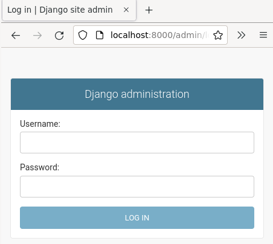  
*Django-admin console ready with Salt*
